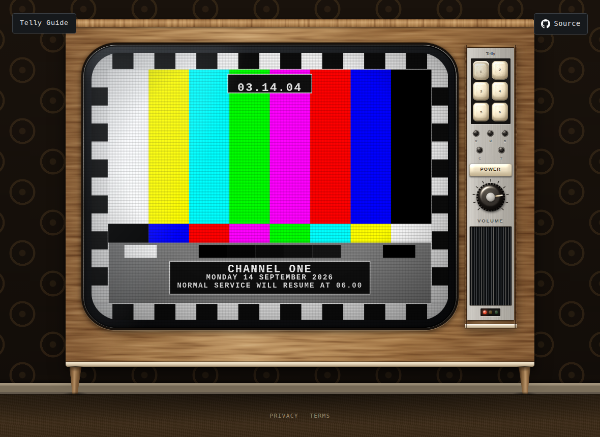
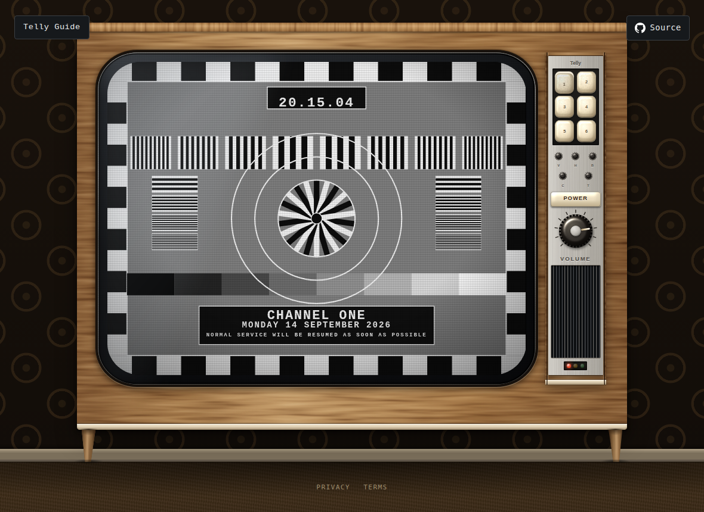

# telly

Your YouTube subscriptions, broadcast as five television channels with their
own schedules. You don't pick what to watch — you switch it on, press a preset,
and see what's on. When nothing is on, you get the test card.



## The one idea

Wall-clock time is the only input. The app never asks *what shall we play next?*
It asks **what should be on air at 14:32:07, and how far into it are we?**

That question gives you join-in-progress, closedown, overruns and the test card
for nothing, and it collapses the whole thing into two pure functions:

```ts
plan(pool, options) -> Schedule      // deterministic, once per broadcast day
tune(schedule, now) -> OnAir         // pure, called every tick
```

Everything else — sign-in, the API, IndexedDB, the iframe player, WebAudio — is
I/O bolted to the edges. A whole broadcast day is provable in a millisecond,
with no network, no browser and no real clock.

## Running it

Needs **Node 20.19+ or 22.12+** (a Vite requirement); `.nvmrc` pins 24. Distro
packages are often still on Node 18, which is below the floor: take the LTS
from [nodejs.org/en/download](https://nodejs.org/en/download) instead.

```bash
npm install
npm run dev        # then press POWER
```

**It needs a client ID to schedule anything.** Without one the set shows the
no-service-configuration fault card. The tests run on a deterministic fixture
pool in `test/support/`, offline and with no credentials.

See [CONTRIBUTING.md](CONTRIBUTING.md) for the full script list and how the code
is arranged, and [docs/](docs/) for how it works and why — [architecture](docs/architecture/)
for the build, [research](docs/research/) for the period detail behind the set.

## Connecting your own subscriptions

1. [Google Cloud Console](https://console.cloud.google.com) → **APIs & Services
   → Library → YouTube Data API v3 → Enable**.
2. **OAuth consent screen** → External. Add yourself under **Test users** —
   without that you get a 403 telling you to contact the developer, who is you.
3. **Credentials → Create credentials → OAuth client ID → Web application**,
   with `http://localhost:5173` as an authorised JavaScript origin. No redirect
   URI; the token client uses a popup.
4. `cp .env.example .env.local`, paste the **client ID** only, and **restart the
   dev server** — env files are read at startup.

A **Sign in with Google** button then appears. Until it does, the set shows the
fault card: `.env.local` is deliberately not in the repository, so a fresh
clone on a second machine has no client ID and therefore nothing to sign in to.

The wording is Google's to choose, not ours: their branding guidelines permit a
closed set of labels, and a more honest one like "Use my subscriptions" is not
on it. Google's script is fetched on mount rather than on the click, because a
popup must be traceable to a user gesture and that gesture does not survive a
network round-trip.

Signing in again is not needed on every visit: the browser records that consent
was given here, and a later page load takes the grant up without a screen.
Google expires the grant itself after a week while the app is unverified, so
the button comes back about that often. **Sign out** hands the grant back to
Google and empties the schedule data this browser saved.

Security posture, and what is stored where, is in [SECURITY.md](SECURITY.md).

A daily refresh over ~200 subscriptions costs about 290 of the 10,000-unit
quota, because IDs are batched 50 at a time. The breakdown is in
[docs/architecture/google.md](docs/architecture/google.md).

## Five channels

Six keys on the fascia and five broadcasters behind them, each with its own
taste, its own hours and its own test cards.

| | Hours | What it is |
|---|---|---|
| One | 06.00–01.30 | The national service. News on the hour, children's television after school. |
| Two | 11.00–02.00 | Serious, but not solemn. Documentaries, arts, and Thursday night is comedy night. |
| Three | 06.00–02.30 | Popular television. Sport, lifestyle, and Saturday variety. |
| Four | 15.00–03.00 | The alternative. Film, arts, and satire on a Friday. |
| Five | round the clock | Never closes. The small hours are a clip show. |

Your subscriptions are divided between them and belong to one each, so tuning
around means something. Which one a channel goes to comes from what YouTube
says it is about; when it goes out comes from how long its videos run, how
often it posts and how well watched it is.

Two of the presets were tuned in carelessly by whoever installed the set, so
they come up as snow until you turn the tuner. Preset six has nothing on it at
all.

Press **Telly Guide** for the listings, which print all five. The first time,
that button counts, `Programming 46%`, because there is nothing to print
until your subscriptions are in and five days have been planned off them. A set
switched on while that is happening holds the station's ident, which is what a
station with nothing to hand out yet put up.

## How a day is built

The broadcast day runs **06:00 → 06:00**, and positions within it are integer
offsets from that anchor, so scheduling arithmetic has no wrapping, no timezone
and no `Date` in it. Each station divides its day into its own parts — the full
tables are in [docs/architecture/stations.md](docs/architecture/stations.md).

**News starts on time; everything else floats.** A programme may overrun and
push the schedule along, but a *junction* begins at its appointed second and
anything running into it is cut short, exactly like being taken off air to go
over to the news.

Nothing age-rated goes out before nine and nothing made for children goes out
after six, both read straight off the API. A station with a handful of
suppliers and nineteen hours to fill repeats, twice a day at most and four
hours apart, and the listings print (R) against it.

A programme that ends at 20.57 leaves three minutes, and what a station does
with three minutes is put its own ident up and start the next one at nine. Each
station has its own, and they are five different mechanisms rather than five
colours of one.

Padding to a junction is the ident too, up to the three minutes a station
would hold one for; longer gaps become the card, and a daypart with nothing
eligible fills with card. A station that has run out
is showing the card, which is both the honest outcome and the thematically
correct one.

## The cards

Five designs, picked from the date, so a card lasts a whole broadcast day and
every set tuned to a station shows the same one with no state anywhere to
drift. Each station rotates through its own two or three, so tuning around
looks different as well as sounding different.

| | |
|---|---|
| `electronic` | the line-up chart: castellations, gratings, colour bars, greyscale wedge, convergence target |
| `bars` | full-height colour bars, a reversed complement band, and a PLUGE strip for setting black level |
| `monoscope` | monochrome resolution chart with a Siemens star at the centre |
| `crosshatch` | white grid on black, for convergence and geometry |
| `ident` | the station card: concentric colour rings and the channel name |

All five are original artwork in the idiom. None reproduces an existing card or
any broadcaster's marks — that vocabulary (colour bars, castellations, greyscale
wedges) is standardised engineering convention and free to use; the specific
cards people remember are authored works and are not.

The card is the channel's **default state, not its error state**. It sits under
every programme and the picture is revealed over it only once the player reports
one actually playing. That is positive confirmation rather than error detection,
which matters because YouTube fails quietly.



## Seeing a particular hour

Most of what a schedule does happens at hours you are not awake for, and the
set has no way to jump to them. It does not need one: nothing in `src/` calls
`new Date()` except `SystemClock`, so time is an argument.

A test hands `App` a `FakeClock` and drives the day by hand:

```ts
const clock = new FakeClock(new Date(2026, 8, 9, 1, 40))
render(<App clock={clock} />)          // closedown on one, the clip show on five
act(() => clock.set(new Date(2026, 8, 9, 11, 58)))   // the lunchtime junction
```

There is no query parameter and no dev-only route, because a second mechanism
for something the seam already does is a second mechanism to keep honest.

## Layout

```
src/
  domain/      the shared vocabulary: time, dayparts, videos, schedule, on-air
  schedule/    the classifier interface and the packer
  programming/ the five stations: genre, profiles, the draft, what goes where
  broadcast/   tune() — wall clock in, what-is-on-air out
  player/      the YouTube IFrame API, behind a seam
  library/     subscriptions -> uploads -> videos; cached in IndexedDB
  testcard/    the five card designs, their geometry, and the renderer
  audio/       the line-up tone, the hiss, and the noises the cabinet makes
  ui/          the screen, and the cabinet it sits in
test/          the tests, mirroring src/; the fakes and the fixture pool in support/
```

The cabinet is drawn, not photographed: teak grain and the highlights on the
knob and buttons are SVG filters — `feTurbulence` and `feSpecularLighting` — so
there are no image assets and it stays sharp at any size.

## Deploying it

Releases are tagged, and a tag is what publishes.

1. A pull request merges to `main`.
2. `bumpversion.yml` reads the conventional commits since the last tag, works
   out the increment, writes `CHANGELOG.md`, commits `chore(release): x.y.z`
   and tags `vx.y.z`. A docs-only merge warrants no release and it exits
   without one, which is a normal outcome rather than a failure.
3. The tag fires `release.yml`, which calls the same reusable workflows a pull
   request runs — `analysers.yml`, `tests.yml`, `codeql.yml` — against the
   tagged commit, then builds, publishes `dist/` to GitHub Pages, and cuts a
   GitHub release last, so a release only exists once the thing it names is
   live.

So the version, the changelog, the tag, the site and the release all describe
one commit, and an accidental publish is not reachable from ordinary
development: nothing in `release.yml` runs on a push or a pull request.

`commit-and-tag-version` rather than commitizen: same convention, but this is a
TypeScript stack and the version lives in `package.json` like every other tool
here. A Python tool to read JavaScript commits would be a second toolchain to
install, pin and explain.

Three things live outside the repository:

- **The client ID.** `VITE_YOUTUBE_CLIENT_ID`, a variable on the
  `github-pages` environment. A variable rather than a secret, because it is
  inlined into a public bundle and marking it secret would only hide it from
  the build log. The `build` job joins that environment and reads it, and that
  job runs behind `needs: [checks, tests, codeql]`, so a missing setting is
  reported only once those have passed.
- **The release App.** `COMMITLINT_CLIENT_ID` (a variable, holding the App's
  numeric id) and `COMMITLINT_CLIENT_SECRET` (a secret, holding the App's
  private key — the `.pem`, not the OAuth client secret it sits beside) on the
  `commitlint` environment, from a GitHub App installed on this repository with
  **contents: write**. This is not
  a preference: GitHub deliberately does not fire workflows for pushes made
  with the default `GITHUB_TOKEN`, so a bump authenticated that way would push
  the tag and `release.yml` would never run — the site would quietly stop
  updating with no error anywhere. An App installation token does trigger
  downstream workflows, and unlike a personal access token it is short-lived,
  scoped to this repository, and not tied to anybody's account.
- **The domain.** `public/CNAME` names `telly.na-n.xyz`. The matching DNS
  record is a CNAME at the registrar — host `telly`, value
  `coolhandle01.github.io.` — and Settings → Pages → Custom domain has to hold
  the same name for GitHub to issue the certificate. Tick **Enforce HTTPS**
  once its check passes.

The domain is a Google requirement rather than a hosting one. Authorised
domains are verified in Search Console as a Domain property over DNS TXT, and
that is impossible for `*.github.io` because you do not control its DNS. So
`na-n.xyz` is verified at the registrar, `telly.na-n.xyz` is the homepage, and
`https://telly.na-n.xyz` is the one authorised JavaScript origin on the OAuth
client. Once the custom domain is set GitHub redirects the `github.io` address
to it, so there is no second origin to keep in step.

No response headers are set. GitHub Pages offers no control over them, and here
that costs nothing: the default `Cross-Origin-Opener-Policy` is `unsafe-none`,
which is exactly what the sign-in popup needs. Setting `same-origin` from a
generic hardening checklist nulls `window.opener` in the popup and the callback
never arrives — silently, with no console error. A host with a `_headers` file
is the move if headers ever become necessary; nothing here requires them.

## Terms and privacy

`public/privacy/` and `public/terms/` are served with the site, and the footer
links them as `privacy/index.html` and `terms/index.html` — the file, so the
link resolves on a server that does not serve directory indexes as well as on
one that does. `/privacy/` and `/terms/` work too, and those are the URLs the
OAuth consent screen points at. They say what telly reads, where it goes —
nowhere — and what YouTube's own player does, which is a separate matter.

## Licence

MIT. See [LICENSE](LICENSE). That covers the code; the terms above cover using
the site.
