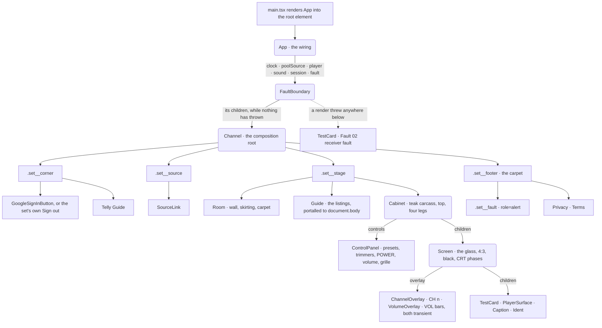
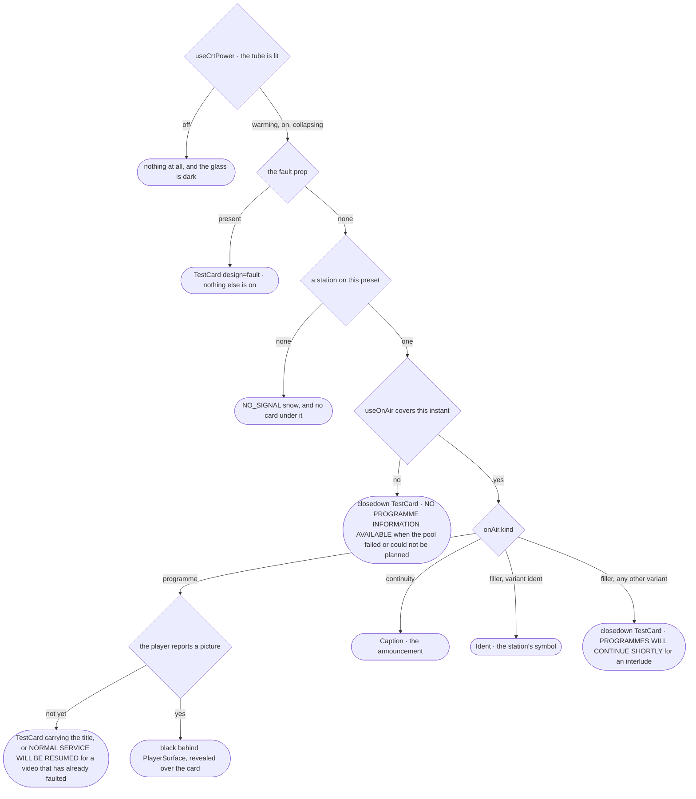
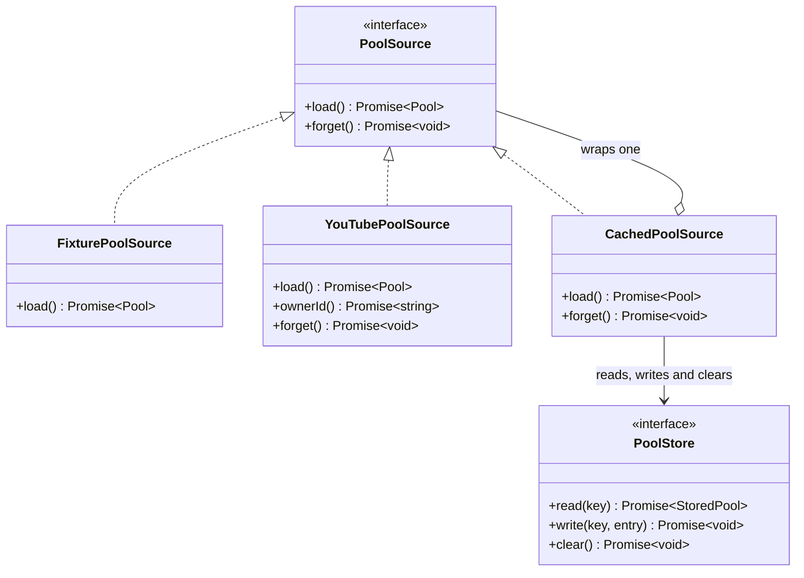
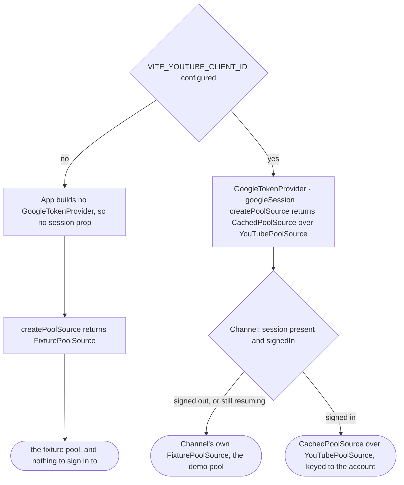
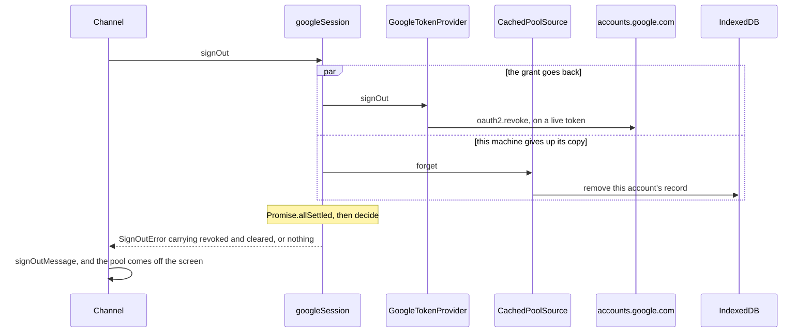

# Components

The set is a React tree with one composition root and a line through the middle
of it. Everything above the line is the television; everything below is not.



## The line

`.set__corner` and `.set__source` hold everything that is not the television. A set
of this period had a power switch, a volume knob and some presets. It had no
button for signing in to anything, and the listings came in a paper on the arm
of the chair.

One control in the corner, not two: the Google sign-in button while nobody is
signed in, the set's own `Sign out` button while somebody is. Neither appears
while a grant already made in this browser is being taken up at page load, which
is the one moment the answer is not yet known. The sign-out button carries no
Google mark and no Google wording, because the branding guidelines cover the
sign-in button alone ([google.md](google.md)).

Keeping the anachronisms off the cabinet is what lets the fascia stay strict,
and it is why the Google button's modern styling does not jar: it is not
pretending to be part of the set.

Both sit in the corner of the room — top left, absolutely positioned — rather
than in a row under the cabinet. That is a height decision. A row beneath the
set costs about fifty pixels of page, and every pixel it takes comes out of the
television. Out of the flow they cost none, which buys the height cap three rem
and the picture about five per cent at laptop sizes.

**The rule that stretches the in-flow children names them.** `.set__stage` and
`.set__footer` get `width: 100%`; the two corners do not, because they are out
of the flow and a stretched out-of-flow box is an invisible sheet across the
whole page that swallows every click underneath it. Written as
everything-but-the-corner it was right until the second corner was added, and
then silently wrong — the source link blanketed the top of the page and the
Telly Guide button stopped responding. An exception list is the wrong shape for
a rule like this, which is the same lesson the room's stacking context teaches
further down.

`SourceLink` holds the one image in the app that is not ours. Linking back to
GitHub is what GitHub publishes its mark for, where the test cards and the
station idents are original because the alternative would be copying somebody's
work — so this is the case where copying is the point, and it is copied rather
than re-traced: the path is `icons/mark-github-16.svg` from primer/octicons
v19.33.0, character for character. The 16px drawing is its own set of curves
rather than a shrunk 24px one, so that is the file to take at this size. The
fill is an explicit white. GitHub publishes the mark in black and in white, and
`currentColor` would hand it the chip's off-white text colour, which is neither.
`SourceLink.test.tsx` pins the fill, the canonical `viewBox` and the square box
the same way `GoogleSignInButton.test.tsx` pins Google's rules: both are
brand-compliance tests in UI-test clothing, because the edits that break a brand
rule are sympathetic ones nobody flags in review.

It stands down while the listings are up, which the opposite corner does
not — the listings put their own close button in that exact spot, and two
controls stacked reads as a mistake even dimmed behind the scrim.

`.set__footer` is a carpet rather than a row. A site
has to make its terms and its privacy policy reachable from the page itself,
and the floor the television stands on is the only surface here that is not the
television. It costs the picture nothing measurable: the cabinet is capped by a
viewport formula rather than by the row's height, so it comes out the same size
at 1440×900, 1280×720, 1024×768, 900×640 and 400×780 with the footer as
without. The one cost is 30px more scroll at 900×640, a window that already
scrolled 12px by the trade in
[research/cabinet.md](../research/cabinet.md).

The two links name `privacy/index.html` and `terms/index.html`, not the
directories holding them. A static host answers `/privacy/` with the index
inside it; Vite's static middleware does not, so such a request falls through to
the single-page fallback and the dev server answers with the television — at an
address that is not the television, against which the relative hrefs then
compound into `/privacy/terms/` and worse. Naming the file resolves on every
server. The `public-directory-index` plugin in `vite.config.ts` closes the other
half, rewriting a directory request to the index inside it so a hand-typed
`/privacy/` behaves in development and preview the way it behaves in production.
`Channel.test.tsx` matches each href against the files Vite globs out of
`public/`, because jsdom does not follow links: one pointing at nothing renders
exactly like one that works.

It is a `footer` element but not a `contentinfo` landmark, because it sits
inside `main` where that role does not apply. Moving `main` inward to earn the
landmark would mean re-plumbing a layout that has cost several subtle paint
bugs, for two links that are in the reading order regardless.

## Channel

`src/ui/Channel.tsx` is the only module that knows the clock, the pool source,
the player and the cabinet all exist at once. It holds:

- the preset state, and `stationById` to turn it into a station;
- `blackStyle` at `#07090b` rather than pure black, so the glass has something
  to act on;
- `pictureStyle(hasPicture)` — the opacity gate that reveals the picture over
  the card (see [player.md](player.md));
- `useCrtPower(on)`: the tube's own idea of whether it is on.
- the `session` prop, and the four pieces of state that follow it: `signedIn`,
  `resuming`, `signingOut` and `sessionError`.

All five schedules are planned in one `planStations` call and held together.
The stations have to be divided up before any one of them can be planned, and
the listings print every channel whether the set is tuned to one or not. The
preset decides which of the five is on the screen and nothing more.

**That call is wrapped.** It runs inside a render, so a throw would reach the
root boundary and take the whole receiver to a fault card that never clears. A
pool that cannot be planned is caught and the listings are `undefined` for that
day instead: the set stays on, shows the card, and tomorrow is planned from
tomorrow's pool. `unplannable` is that state, and it is the pool's failure, not
the receiver's.

### What decides what is on the screen

One chain of conditions in `Channel`, in this order. The tube's own phase comes
first and the schedule comes last, so nothing the schedule says can put a
caption on a dark screen.



The card is the default state of a channel and not its error state. A programme
that fails in a way nobody predicted, no error event, a silent iframe, a blocked
script, leaves the card up rather than a blank screen, because nothing had to go
right for the card to be there.

### Four states that are easy to conflate

A screen with nothing on it can be in four different conditions, and a viewer
could tell them apart across the room.

**Off is nothing at all.** No caption and no channel name. The only thing a
dark screen can say is the one thing it has already said.

**An empty preset is snow and hiss.** Six keys on the fascia, five stations, so
one key has no carrier under it at all. `NO_SIGNAL` in
[`picture.ts`](../../src/ui/picture.ts) pins the snow to full and the colour to
nothing, and no picture control moves it, because there is nothing for them to
work on.

**A mistuned preset is snow with a station under it.** Each preset has its own
point in the tuner's travel, and two of them are not at mid-travel. Turning the
tuner brings the station in: the colour returns first, then the picture. See
[stations.md](stations.md).

**A test card is a station on the air with nothing on.** Clock, date,
resumption time and the 1 kHz line-up tone: a positive statement that the
transmitter is working and the schedule will be back.

### The sound follows the screen

`src/audio/sound.ts` is one interface with four sounds, because a set has one
speaker. `tone(hz)` is the line-up tone, `hiss()` is the noise between
stations, and `click()` and `clunk()` are the cabinet's own mechanical noises.

Which of the first two plays is read off what is on the glass:

```ts
const hissing = on && !fault && (!carrier || tuned.snow >= HISS_AT)
const toning  = on && !fault && !hissing && atClosedown
```

Reading the schedule instead would let two screens showing the same thing sound
different, which is the set lying about one of them.

The volume knob drives `setLevel(0..1)` and each sound is scaled into its own
ceiling: the hiss is quieter than the tone at the same setting, because
broadband noise at one frequency's level is a hairdryer. A fault card is
silent — nobody transmitted it. A click and a clunk go straight to the
destination past the volume gain, because they are made in the room rather than
sent by a transmitter, and turning the sound down does not stop a switch
clicking.

The audio context opens in `prepare()`, from the click on the power switch.
That is the only gesture available: closedown is hours away from anything the
viewer last touched.

### The on-screen displays

`Osd` draws the box and the lettering; `ChannelOverlay` and `VolumeOverlay` put
`CH n` and `VOL` in it. They sit in different corners because two generators in
one corner would draw over each other. `useTransientFlag(value)` is false on
first render and true for two seconds after the value changes: arriving at a
channel is not the same event as changing it.

## The pool source seam

`PoolSource` in `src/library/poolSource.ts` is one method wide, and nothing
above it can tell which implementation it was handed. `forget` is the second
method and it is optional: only a source that keeps something has anything to
drop.



The record `CachedPoolSource` keeps is filed under whose it is: the key is
`pool:<the account's own channel id>`, and the id comes from `channels.list`
with `mine=true` through `YouTubePoolSource.ownerId`. A scope that cannot be
established is not a key, so there is no read and no write until the account is
known.

`createPoolSource` builds the source from the configuration, `App` holds it, and
`Channel` chooses between it and a fixture of its own.



Signed out with a service configured, the set runs on the demo pool. The
alternative is a request with no token behind it, which fails, so the first
thing a first-time viewer would see is a failure rather than television.

The screen says nothing about it, because these are real videos and they
schedule like any others. The paper does: the listings carry `Sample
programmes. Sign in to see your own subscriptions.`

## The session seam

`src/library/session.ts`. One object, four methods:

```ts
export interface Session {
  signIn(): Promise<void>
  signOut(): Promise<void>
  resume(): Promise<boolean>
  subscribe(listener: (signedIn: boolean) => void): () => void
}
```

It is an object rather than a handful of callbacks because the screen has to
show a session rather than the outcome of the last click. A token expires an
hour in whether or not anyone touched the set, and `subscribe` is how the button
that says Sign out learns to say Sign in again.

`googleSession(tokens, source)` is the implementation a signed-in viewer gets,
and it is where signing out becomes two obligations rather than a sequence. The
token half is in [tokens.md](tokens.md).



`App` builds one only when a client ID is configured. No client ID, no session
prop, and `Channel` runs on the fixture pool with nothing to sign in to. The
prop must be **stable across renders**: it feeds a subscription and a page-load
effect, and a fresh object each paint would re-run both.

A sign-out that only revoked would leave a day-old list of somebody's
subscriptions on a machine they have just finished using, and one that only
cleared would leave the grant standing at Google, so each half is attempted
whatever the other does and each is reported. Which half survived decides the
sentence: `signOutMessage`, below. Either way the pool comes off the screen with
the session.

### `forget` and `clear`

Two new methods on two old interfaces, and what the cache makes of them:

| | |
|---|---|
| `PoolSource.forget?(): Promise<void>` | Optional. Only a source that keeps something has anything to drop. `YouTubePoolSource` drops the memoised owner id, so the next account to sign in is keyed as itself. |
| `CachedPoolSource.forget()` | Both halves are attempted whatever the other does, or a database that will not open would leave the source still keyed to the account that just signed out. A fetch already in flight writes its pool when it lands, so the removal is repeated once that write has had its chance. A rejection from either half is rethrown rather than swallowed: a load that cannot read its cache still has television to fall back on, and a sign-out that cannot clear it has left somebody's subscriptions on the machine after telling them otherwise. |
| `PoolStore.remove(key): Promise<void>` | Required, so no store can quietly lack it. `IndexedDbPoolStore` implements it as an object-store `delete(key)`: one record, not the whole store. |

One key on purpose. A record belongs to the account that signed in for it, and
a viewer signing out has asked to be forgotten rather than asked for everybody
else at this machine to be forgotten with them. A set in a hall or a library has
had more than one person signed into it, which is the reason to leave the others
alone, not the reason to take them. Clearing the site's data is how a viewer
removes the lot.

The key is resolved before either half of a sign-out runs, because the inner
source is about to forget which account this was and the token it would ask
with is about to be revoked. A key that cannot be established throws rather than
reporting a removal that did not happen.

## When something fails

`src/ui/faultMessage.ts` is the only place in the app that turns a failure into
words. Everything it is given is a typed error carrying the one field that
decides the sentence, so no handler has to guess which thing went wrong and no
`error.message` reaches the screen anywhere.

| Failure | The field that decides | The function |
|---|---|---|
| The programmes could not be fetched | `YouTubeApiError.status` | `faultMessage` |
| Signing in produced no token | `SignInError.reason` | `signInMessage` |
| Signing out left one half undone | `SignOutError.revoked` and `.cleared` | `signOutMessage` |

Three components, three different failures, and they are not the same screen.

### `faultMessage`: the programmes could not be fetched

`src/ui/faultMessage.ts` maps an error to the station's own words. The
endpoint, the status code and Google's own message stay in the `Error` object,
which is the right thing for whoever is holding it and the wrong thing on a
screen somebody is sitting in front of.

| What came back | What the viewer is told |
|---|---|
| 429 | `YouTube is asking for fewer requests. Programmes return in a minute or two.` |
| 401 | `Your YouTube sign-in has run out. Sign in again to see your subscriptions.` |
| 403 with `quotaExceeded` or `dailyLimitExceeded` | `Today's allowance of YouTube requests is spent. Programmes return tomorrow.` |
| 403 otherwise | `YouTube would not answer for this account.` |
| anything else, including anything that is not a `YouTubeApiError` | `YouTube could not be reached.` |

429 and 403-with-a-quota-reason are separate sentences because they are
different waits: the per-minute limit clears in seconds, the day's budget clears
at midnight Pacific. Telling a viewer to come back tomorrow when the answer is
"in a minute" is as wrong as the reverse.

### `signInMessage`: signing in produced no token

Each reason asks the viewer for something different, and one asks for nothing.

| `reason` | What the viewer is told |
|---|---|
| `popup_closed`, `popup_closed_by_user`, `dismissed` | `Sign-in was closed before it finished.` |
| `popup_failed_to_open` | `This browser would not open Google's sign-in window. Allow pop-ups for this site, then try again.` |
| `access_denied` | `Google did not grant access to your subscriptions. Signing in again asks for it once more.` |
| `unavailable`, and anything that is not a `SignInError` | `Google's sign-in could not be loaded. An extension or a network filter may be blocking accounts.google.com.` |
| any reason this app has no sentence for | `Sign-in did not finish. Try again.` |

A viewer who closed the window meant to close it, so that sentence asks nothing
of them. `unavailable` is a script that never arrived, so it never reached
Google to be given a reason of Google's.

### `signOutMessage`: one half of signing out did not happen

Signing out revokes the grant at Google and empties this machine. They fail
independently, and which one failed decides what the viewer has left to do.

| Which half survived | What the viewer is told |
|---|---|
| The grant still stands | `Signed out here, and the saved programme list is gone. Your access is still granted at Google: withdraw it in your Google account permissions.` |
| The list is still here | `Signed out, and your access is withdrawn at Google. This browser would not clear its saved programme list: clearing this site data removes it.` |
| Neither happened, or the error is not a `SignOutError` | Both are named. |

Naming the wrong half sends somebody to fix a thing that is not broken while
the thing that is stays broken, so each sentence is asserted not to mention the
half that succeeded.

The message lands under the cabinet in `.set__footer` with `role="alert"`, and
in the listings as the page's notice. Nothing goes to a console: there is no
logging layer here, on purpose, because a token must never reach a log.

### `FaultBoundary`: the part that says things is the part that broke

`src/ui/FaultBoundary.tsx` is the root error boundary. `main.tsx` renders `App`
straight into the root and `App` renders `FaultBoundary` around `Channel`, so a
render-time throw anywhere in the tree arrives here.

It puts up the fault card, `Fault 02 · receiver fault`, over `Something has gone
wrong inside this receiver.` The card needs a sized box to resolve against, so
the boundary renders its own `main.set` and `.screen` wrapper rather than
reusing anything that may have been what threw.

**It never retries.** A boundary that re-renders its children is betting the
cause has gone away, and the cause of a render throw has not: a pool of the
wrong shape is still the wrong shape. A real set that has lost its line output
does not have another go every few seconds either.

This is the receiver's own fault card, and it is not the one a missing client ID
shows (`Fault 01 · no service configuration`, handed to `Channel` as the `fault`
prop) and not the one an unplannable pool shows, which is an ordinary closedown
card with the set still on the air.

## Screen, and the tube

`Screen.tsx` is the glass. It belongs to the television rather than to anything
shown on it, so the vignette and the phase animations live here and not inside
the card, and a card, a picture and a caption all get the same treatment.

`src/ui/trim.ts` holds the arithmetic all five trimmers share. Each runs 0..1,
and three of them lock over a band rather than at a point. The band-edge
rounding is in one place because it is subtle: without it a control parked
exactly on the mark reports a drift of 1.3e-16, and the set reports a lock it
plainly has as lost. `bandDrift` takes the band's centre, which is mid-travel
for a hold and the station's own point for the tuner.

The glass is three nested layers, because they are three circuits and any of
them may be doing something at once. `.screen__tube` carries the power phases,
`.screen__raster` the frame oscillator, `.screen__line` the line oscillator.
They are separate elements because each drives `transform`, and one element
cannot be collapsing, rolling and tearing at once.

The lift and snow overlays sit inside `.screen__tube`, so the collapse takes
them down with the picture. Snow is the same beam drawing noise instead of a
signal, not a sheet laid over the glass.

The set's own display — `CH 3`, `VOL` — goes in the `overlay` slot, which sits
inside the tube but above the snow and outside all three deflection layers.
Those characters are made in the cabinet and mixed in after the tuner, so
nothing the tuner does reaches them: a set that hid its volume display whenever
there was no signal would hide it exactly when you were most likely to be
turning something. Passed as `children` instead, the display lands inside
`.screen__line` and a fully opaque snow layer paints straight over it — present,
correctly sized, and invisible, which jsdom cannot tell from working. The tests
therefore assert where the node sits rather than that it exists.

`useCrtPower` gives the set four states, not two: `off`, `warming`, `on`,
`collapsing`. The picture stays mounted through the collapse or there is
nothing left to collapse. The phase lands on `data-phase` and CSS does the
rest. The physics is in
[research/screen-effects.md](../research/screen-effects.md).

Reduced motion is derived during render rather than animated into:

```ts
return reduced ? (on ? 'on' : 'off') : phase
```

so there is no intermediate state to catch the set in.

## The cabinet, and drawn materials

There are no image assets. Teak grain, the dome on a button, the spun aluminium
of the knob cap and the linished fascia are SVG filters: `feTurbulence` for the
noise, a gamma transfer to separate it into grain, `feSpecularLighting` for
anything that catches the light. It stays sharp at any size and the whole set
is a few kilobytes.

`surfaces.tsx` holds `WoodSurface` and `MetalSurface`; `type.ts` holds the
fascia's typography (`LEGEND_FONT`, `BADGE_FONT`, `NO_SELECT`). The idiom and
the reference material are in [research/cabinet.md](../research/cabinet.md).

Two structural rules that are easy to undo by accident:

- **Every surface is lit from the upper left.** Nothing gives a render away
  faster than two surfaces lit from two directions.
- **`surfaceIds.ts` namespaces every SVG `id`.** Filter and gradient ids are
  document-global, so two sets on one page would silently share filters.

## The controls are real controls

`ControlPanel.tsx`, and the rules it follows:

- **No button relabels itself.** `PushButton`'s legend says `Power` whether the
  set is on or off, because that is what a stamped legend does. State shows in
  the key sitting down in its collar.
- **The presets are a native radio group** (`name={id('channel')}`,
  `role="radiogroup"`). Exactly one is always in, which is what a mechanical
  preset bank does mechanically, and the browser gives it for free including
  arrow-key movement.
- **V, H, B, C, T are knobs, not buttons.** Vertical hold, horizontal hold,
  brightness, colour, tuning: a set of this period adjusted those with
  trimmers.
- **No control contains selectable text.** `NO_SELECT` is on every legend, so
  dragging a knob never leaves half the fascia highlighted in blue.
- **All five trimmers adjust something.** `ControlPanel` takes them as one
  `trimmers` map keyed by what each adjusts. A trimmer is live only when it is
  in that map: give it one and it becomes a `role="slider"` with a tab stop,
  leave it out and it stays a drawing with `aria-hidden`. A control a viewer
  can reach that adjusts nothing is worse than a picture of one.
- **Every rotary control shares `useRotary`.** The volume knob and the hold
  trimmers are the same control at two sizes.
- **The cap label does not intercept the click.**
  `.tv-fascia__cap-label { pointer-events: none }`, or the label eats the
  radio.

Every control also makes a noise, fired from `Channel` where the handlers
already are: a detent for a knob, a key going down for a preset or the power
switch. The drawn controls stay presentational and know nothing about audio.

## The room, and two stacking-context rules

`Room` is scenery: wall, skirting and carpet, drawn in gradients and bled a
viewport past the stage so it reaches the edges of the page. `.set` clips that
bleed, or it is a scrollbar. The floor starts at the stage's bottom edge, which
is where the feet are, so the set stands on the carpet at every size without a
measurement anywhere.

It sits at `z-index: -1` inside a stage that `isolation: isolate` makes a
stacking context. Lifting the siblings instead — `.set__stage > :not(.room) {
position: relative; z-index: 1 }` — reaches absolutely positioned children too
and undoes them. A rule that says "everything except" eventually catches
something that needed to be excepted.

`.set__footer` carries `position: relative; z-index: 1`. `.set__stage` is
positioned, and a positioned element paints above the in-flow content of a
later sibling, so the room's floor would otherwise paint straight over the
fault row. The element would be present, the right size, in the right place,
and returned by `elementFromPoint` as topmost — and never drawn.

Neither rule is visible to the test suite. jsdom has no paint, so a node that
is present, correctly sized and completely invisible looks exactly like a node
that works. Both are checked in a browser.

## The listings

A television of this period had no on-screen guide and no way to get one: you
looked it up in the paper. `Guide` is a sheet of newsprint held up in front of
the set, and the one thing on the screen allowed to be bright.

It is a column to a channel, times down each one, which is how a paper set it.
An hour-by-hour grid across all five would be an anachronism twice over: nobody
printed one, and no television could have drawn one.

`listing(schedule, dayparts)` turns a `Schedule` into a page. Programmes get a
line each, runs of card and continuity collapse into one, and a daypart marked
`stripped` collapses its programmes too — a paper printed `2.00 Clip Show`, not
two hundred and forty clips. Repeats are printed `(R)`.

### Two rules that keep it quick

**The pool arrives in a transition.** Planning five broadcast days is a couple
of hundred milliseconds of arithmetic inside a render, and a source that
resolves without touching the network resolves in a microtask — so without
`startTransition` around `setPool`, the click that opened the listings, the
pool arriving and all five days being planned land in one task and the browser
paints none of it until the end. The page is in the DOM the whole time and
nobody can see it. Measured on a six-times-throttled CPU: 690ms from click to
anything on screen, against 243ms with the transition.

**The columns are memoised and read the clock to the minute.** Everything in a
column is settled for the whole broadcast day except which line is ringed, and
the ring moves a few times an hour. Passing the set's own clock straight
through re-reads five schedules and re-lays two hundred lines sixty times for
each time the answer changes — 14ms of main thread a second on that same
throttled CPU, for nothing.

### An empty page still goes out

The page goes out as soon as it is asked for, whether or not there is anything
to print on it. The listings are worked out from a pool that has to be fetched,
and a page that renders nothing until that lands is indistinguishable from a
button that does not work — so an empty one carries the masthead, the date, and
the line a paper printed when the schedules had not arrived, or the reason the
fetch failed where there is one.

The page is portalled to `document.body`. Inside the stage it would sit in that
stacking context, and the controls in the corner of the page would paint over
it however high its z-index. It closes on the button, on Escape, and on a click
anywhere off the paper.

Opening it cannot move the television, because a fixed overlay contributes no
width and no height to anything. The set is measured open and closed at six
widths and is pixel-identical.

**The scrim scrolls, and the sheet inside it is one piece of paper.** A
newspaper has no fixed masthead with the columns sliding underneath it — you
move the whole page — so nothing here scrolls on its own and no heading is
sticky. The sheet is centred with `margin: auto` rather than by the scrim,
because a centred item taller than its scroll container has its top clipped
with no way to scroll back to it; auto margins centre and give way.

Putting the paper down is not something printed on the paper, so the close
button is fixed to the corner of the screen and set in the set's own type
rather than the page's. Three thousand pixels into the listings it is still
there. It stays inside the dialog element so a screen reader still sees it.

**Every column carries the same rule and the same padding**, and only the
colour of the rule changes. Putting the border and the padding on the adjacent
sibling alone — the obvious way to keep a rule out of the first gutter — makes
the first column's content box wider than the rest by exactly that much. The
grid tracks stay equal and the headings inside them do not, which shows as one
bar being longer than its neighbours: 216px against 199px at 1440.

**The channel the set is tuned to is marked down the whole column**, not round
its heading. An outer `box-shadow` ring paints two pixels on every side and
contributes nothing to layout, so the ringed bar measures identically to its
neighbours and looks four pixels bigger in both directions — and the space
cannot be reserved on the others, because a transparent ring paints nothing.
`getBoundingClientRect` reports all five as equal either way, so measuring the
boxes will not find it. Anything marking one column has to sit inside the box
every column already has.

Five columns become three below 62rem and one below 40rem. The scroll to what
is on now runs only while every column is on one row: wrapped onto a second
row, it would hide the last two channels below the fold with no sign they were
there.

jsdom sees none of this. Both rules are checked in a browser.

## Reach, and the page around it

**The ink stays small; the target grows.** A slotted trimmer is the size of a
screwdriver head, and drawing it bigger would be drawing a different control.
So the trimmer row is wider than the trimmers in it — each cell clears the
24×24 minimum with the drawing in the middle of it — and the power key, a slim
rectangle because that is what it was, reaches past its own moulding with a
pseudo-element. Both stop short of the gap to their neighbours, because two
targets that overlap fail the spacing rule as surely as one that is too small.

Everything interactive clears 24×24 at desktop and phone widths. Lighthouse
also wants 48×48 for its mobile tap-target audit, which a fascia of this period
cannot give without becoming a different object. Every control is a real
`button` or `role="slider"` with full keyboard support.

**`Channel` renders `<main>`.** Without a landmark there is nothing for a
screen-reader user to skip to, and every piece of content on the page sits
outside every region. The page layout lives on a `.set` class rather than
`#root` so the landmark can carry it.

`public/` holds what the site serves besides the app: `robots.txt` and
`llms.txt`. The latter describes what telly is and how it works, for anything
reading the site rather than watching it.

## Sizing

The cabinet is `max-width: min(72rem, calc(137vh - 16rem))`, set as `--set-w` in `Cabinet`. The height follows
from the width (a 4:3 tube in a fixed surround) so on a short window it has
to be told to stop, or it grows taller than the viewport and you scroll to find
the legs.

`.set` is a two-row grid, and `.set__stage` and `.set__footer` take `align-self: safe center`. Safe centring matters:
on a short window the set is taller than the space it has, and plain centring
pushes its top off screen with no way to scroll back. `safe` aligns to the
start instead.

`justify-items: center` on that grid shrinks the cabinet to its content width.
Stretch the columns and let the cabinet size itself from its own `max-width`.

## Testing a drawn cabinet

Query the DOM a user sees, never the drawing. The cabinet was rebuilt from
plain buttons into a wooden console without a single component test changing,
because the tests ask for `getByRole('button', { name: 'Power' })` and not for
a class name or an SVG filter.

The corollary is that the suite cannot see the cabinet at all. See
[testing.md](testing.md).
