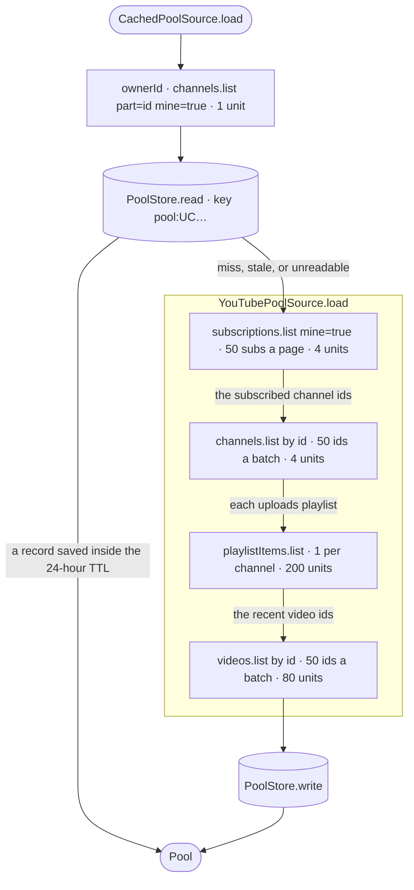
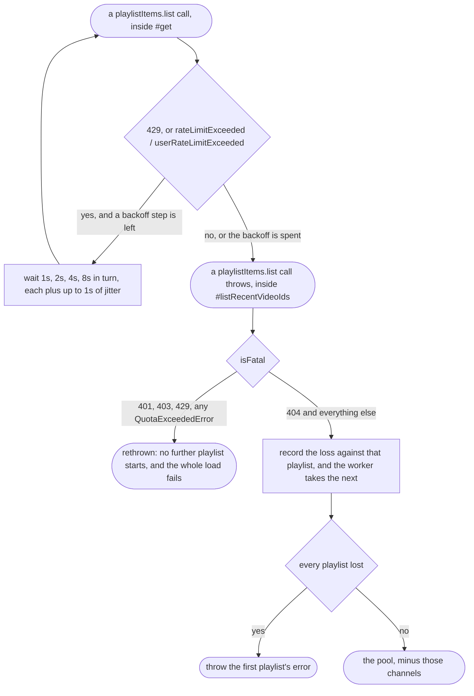

# Google integration, and brand compliance

Sign-in itself is in [tokens.md](tokens.md). This is what happens with the token
once you have one, and what Google asks of the UI that requests it.

## The pipeline

`src/library/youTubePoolSource.ts`, and the quota table in that file's header is
the same one as below.

The owner id is established **before** the read, because the key is made out of
it (`#keyFor`), so a warm cache still costs that one unit.

**The two 50s are load-bearing.** `channels.list` and `videos.list` take a
comma-separated list of IDs, and the app sends at most 50 a call
(`MAX_IDS_PER_CALL`); YouTube documents `maxResults` as 1 to 50 and states no
maximum for `id`. Batching them is the difference between the cost below and
thousands of units against YouTube's documented default of 10,000 a day. A loop
that fetches one ID at a time works in development and fails on a real
subscription list.

YouTube documents each of these list calls as costing 1 unit, so the cost is
the number of calls:

| call | per | 200 subs, 20 videos each |
|---|---|---|
| `channels.list` with `mine=true` | the owner | 1 |
| `subscriptions.list` | 50 subs | 4 |
| `channels.list` | 50 ids | 4 |
| `playlistItems.list` | 1 channel | 200 |
| `videos.list` | 50 ids | 80 |

**~290 units** against 10,000 a day. A `videos.list` per video would be 4,000 on
its own.

Only `videos.list` returns duration, embeddability and category (the three
things the classifier needs) so the last hop is not optional.

### Whose subscriptions these are

`mine=true` answers for whoever the token belongs to, so this is an identity
the `youtube.readonly` scope already covers: no profile scope, no name, no
address. It exists to key the cache, and the memo lives as long as the source,
which is the life of the page. `forget()`, on sign-out, drops it, so an account
that signs in after a sign-out is keyed as itself. A session that ends without a
sign-out does not drop it ([threat-model.md](threat-model.md) T36).

**`playlistItems.list` is the one that cannot be batched**, so it is one call
per subscription: two hundred subscriptions is two hundred calls, and made one
after another that is most of a minute of a viewer looking at a button that
appears to do nothing. Eight are in the air at once (`mapLimit`). The charge is
per call and the number of calls is unchanged, so this costs no extra quota: it
only stops the wall clock from being the sum of every round trip. It also does
not change the pool: `mapLimit` returns results in the order the items went in,
so the day planned from the pool does not depend on which channel's server
answered first.

Stopping matters as much as starting. Once one playlist fails the load, with a
401, 403 or 429 or spent quota, `mapLimit` hands out no more, so the failure
costs at most the calls already in flight rather than another two hundred.

## Progress

`load(onProgress?)` reports a fraction from 0 to 1, and the Telly Guide button
shows it while the set is programming. The denominator is arithmetic off the
subscription count (one call per 50 channels, one per channel for its uploads,
one per 50 videos), refined downward once the real video count is known. It
only ever shrinks, so the fraction only ever moves forwards; a load that
finishes a little early is a better lie than one that sits at 99%.

## Error triage

The rule is: **is this error about *them* or about *us*?**

A **404 playlist is skipped, not fatal.** Any subscription list that has been
around a while contains channels that have been deleted or gone private, and
that should cost you those channels, not the other two hundred. This was a real
bug: one dead playlist took the whole load down.

A **401, 403 or 429** is about our credentials or our allowance, so it will fail
identically for every remaining channel. Continuing would mean two hundred
pointless requests and a misleading empty result.

**The per-minute limit is waited out first.** It clears in seconds, so `#get`
repeats any call it refuses (a 429, or either rate-limit reason on any status)
after each step of `RATE_LIMIT_BACKOFF_MS`, and only a call still refused after
the last step throws. The daily quota, a refused token and a refused request are
not waited out: none of them clears in seconds. Eight calls in the air means
eight backoffs, and the jitter keeps them from coming back together.

429 is in `isFatal` by status as well as by reason. The per-minute limit comes
back as `rateLimitExceeded` or `userRateLimitExceeded`, which classify as
`QuotaExceededError`, but a 429 carrying neither reason is the same wall. It was
not always: a 429 inside the per-playlist loop used to be swallowed once per
playlist, so every playlist failed the same way and the load finished with an
empty pool, which the screen reported as "No videos found in your
subscriptions". That was false, and it is the reason for the second rule:

**Every playlist failing is a failure of the load.** An empty pool is shown as
an empty subscription list, and this is the case where that would be a lie.

What a viewer is told about any of this is in `src/ui/faultMessage.ts`, not
here: the endpoint, the status and Google's own wording stay in the `Error`. See
[components.md](components.md).

## Caching

`CachedPoolSource` persists to IndexedDB with a **24-hour TTL**, and degrades
to calling straight through when there is no usable store, so a browser that
gives it no store still gets television. The TTL decides when a record is used,
not when it is deleted: a record stays until a fresh load replaces it, its
account signs out, or the browser's data for the site is cleared or evicted.

What is stored is the pool: the subscribed channels' ids, names, topics and
subscriber counts, and up to twenty uploads from each, with titles, durations,
dates, categories, view counts and flags. No token ever reaches it.

**The key names whose data it is.** `CachedPoolSourceOptions.scope` is joined to
the key, and `createPoolSource` passes `() => live.ownerId()`, so the record is
filed under `pool:<the account's own channel id>`. Two accounts on one browser
each get their own record, except in the case in
[threat-model.md](threat-model.md) T36.

A scope that cannot be established is **not** a key. `#keyFor` returns
`undefined`, and there is then no read and no write at all, because reading
under the bare `pool` key would serve whoever was here last. A source that holds
nobody's data passes no scope: the fixture is the same pool for everyone.

`forget()` removes this account's record (`PoolStore.remove(key)`) and forwards
to the inner source, attempting both whatever the other answers, and reporting
a failure rather than swallowing it. It is what signing out does to the copy
held on this machine. It removes one key, not every key: a set in a hall or a
library has had more than one person signed into it, and the one leaving does
not get to remove the others' records. Clearing the site's data removes them
all.

## Brand compliance

Verification aside, Google's sign-in branding guidelines constrain the button
itself, and the constraints are not the ones you would guess.

**The wording is a closed set.** The guidelines name "Sign in with Google",
"Sign up with Google" and "Continue with Google", and say "Localization of this
text to match the language of your app or website is permitted and encouraged".

A wording like "Use my subscriptions" is more honest about what happens (telly
does not authenticate anyone, it asks an already-signed-in user to authorise a
read scope), but it is not on the list. Whether the closed set binds an
authorisation-only button is unclear. Assume it does: brand review looks at the
UI that triggers consent, and a rejection on wording costs a round trip.

**The font is the one constraint the app does not meet exactly.** The
guidelines say "The button font is Google Sans Medium." The button declares
`'Google Sans', Roboto, arial, sans-serif` at weight 500 and loads no web font,
so it shows Google Sans only where the viewer's machine has it installed.
Google provides the button images "in PNG and SVG formats".

`src/ui/GoogleSignInButton.tsx` draws the mark by hand, and its tests are
compliance tests rather than UI tests: each pins a rule a sympathetic edit would
quietly break, far from the submission it would fail:

- permitted wording as the accessible name;
- the mark `aria-hidden`, so the label alone names the button;
- `viewBox="0 0 48 48"` with equal width and height, which keeps the logo's
  aspect ratio: the guidelines allow scaling the button "but you must preserve
  the aspect ratio so that the Google logo is not stretched";
- the four brand colours pinned exactly: the guidelines require "the standard
  color version (the standard color gradient super G logo)".

One further rule applies if the theme ever changes: the guidelines say the G
must "appear on a white background", so on a filled theme it needs a white
background of its own. The light theme is used here partly because the button
is already white.

The button sits **off the cabinet**, in `.set__corner`. A 1975 television had no
button for authorising a read scope, and the anachronism does less harm down
there.

**The way out carries no Google mark.** The guidelines cover the button that
starts the consent flow, and say "Use of Google brands in ways not expressly
covered by this document is not allowed without prior written consent from
Google".
So the sign-out control in the same corner is the set's own plain button, it
says `Sign out`, and it names Google nowhere. Neither control is rendered at all
while a page-load resume is still in flight ([tokens.md](tokens.md)).

## Verification

`youtube.readonly` is a **sensitive** scope. Google's sensitive-scope
verification page says "if your app is in the development, testing, or staging
phases, verification isn't required", and that page does not mention a
security assessment.

For verification, Google's pages say: "Verify ownership of your project's
authorized domains within the Google Search Console. Use a Google Account
that's associated with your API Console project as an Owner or an Editor."
"The **Authorized domains** section also needs to include the redirect URIs or
JavaScript origins authorized in your 'Web application' OAuth client types."
And: "The privacy policy must be visible to users, hosted within the same
domain as your application's home page, and linked to on the OAuth consent
screen."

One trap worth recording because it fails **silently**: never set
`Cross-Origin-Opener-Policy: same-origin` on the hosting. Google's setup guide
says that when FedCM is disabled, "Failing to set the proper header breaks
communication between windows, leading to a blank pop-up window or similar
bugs." The site sets no such header, so the page has MDN's default,
`unsafe-none`, and sign-in works on it. `Cross-Origin-Embedder-Policy:
require-corp` has not been tried: MDN documents that under it a cross-origin
resource loads only in `cors` mode or with a `Cross-Origin-Resource-Policy`
that allows it, and whether `accounts.google.com/gsi/client` qualifies was not
checked.
