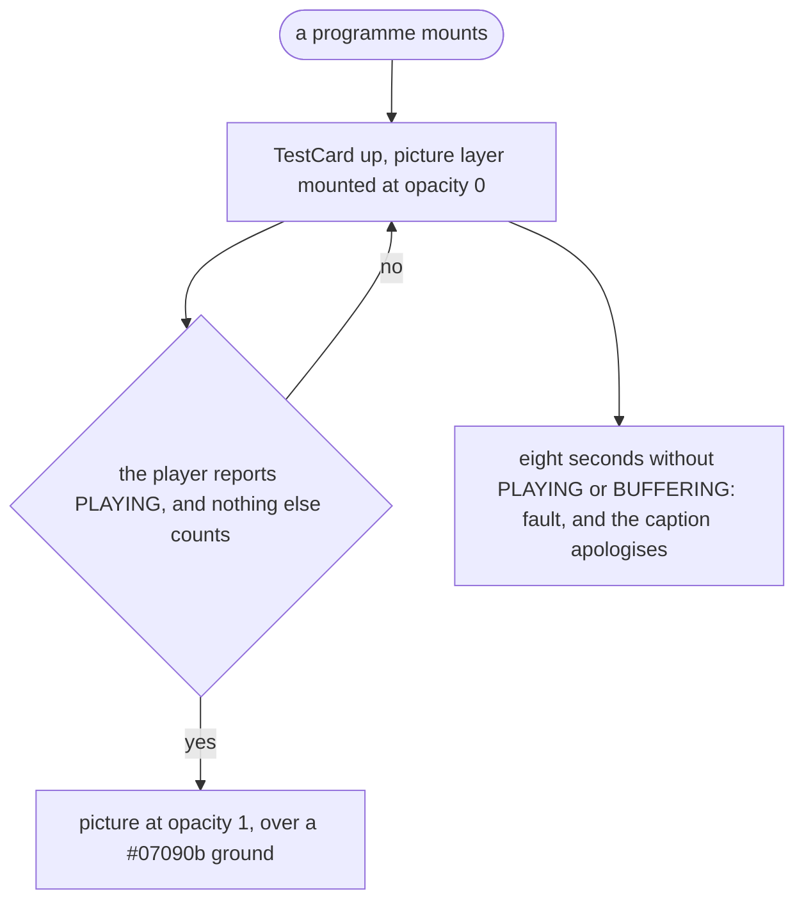
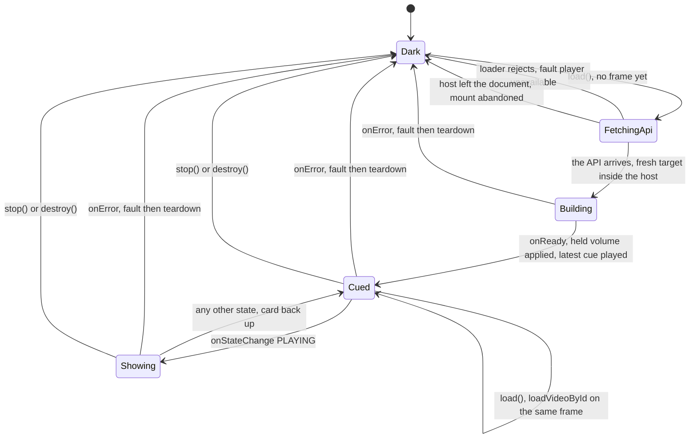

# The player, and the signal

## The card is the base signal

The test card renders **unconditionally** beneath every programme. The picture
is a layer above it, revealed only when the player reports one *actually
playing*. Programming is an override on a signal that is always there.



In `src/ui/Channel.tsx` that is an opacity gate, `pictureStyle(hasPicture)`,
over the card. Once there is a picture the card gives way to `blackStyle`,
`#07090b` rather than pure black, so a 16:9 programme in a 4:3 set gets proper
bars and the glass has something to act on.

This is **positive confirmation, not error detection**, and the distinction is
load bearing.

YouTube fails quietly. In this app's use it has, for some bad IDs, rendered its
own "unavailable" page inside the iframe without firing an error event. Wait for
an error and you wait for ever, with a black screen. Wait for a picture and the
worst case is the card staying up, and *nothing has to go right* for the card to
be there.

The watchdog is `DEFAULT_START_TIMEOUT_MS`, and it faults with `'no picture'`.
**Buffering counts as progress but is not a picture**: it stands the watchdog
down without revealing the video, because buffering is a picture on its way.

## One mount, from dark to picture



`Dark` is a card and no player object at all. Every arrow back to it from a
built frame runs `#teardown()`, and the next `load()` builds one from scratch;
the two out of `FetchingApi` never built one. The five things below are why.

## Five things that look odd until they don't

Each of these was a real evening of black screen, and each describes behaviour
seen in a browser rather than read in YouTube's reference.

**An error tears the player down.** A YouTube player that had errored *stayed*
errored: `loadVideoById` on it did nothing, silently. Without a rebuild, one
failed video meant no picture for the rest of the night.

**So does `stop()`.** The surface removes its host element when it unmounts, and
**an iframe that moves in the DOM reloads**, which severs the player object from
the frame it thinks it is driving. This is why powering the set off and on used
to kill the stream until a refresh.

**Each mount gets a fresh target inside the host.** The IFrame API *replaces*
the element it is given with an iframe, so it cannot be handed the same one
twice:

```ts
const target = document.createElement('div')
target.style.position = 'absolute'
target.style.inset = '0'
this.#host.replaceChildren(target)
```

The size must also go in the *options* (`width: '100%', height: '100%'`), not
just in CSS on the target: the target is gone by the time the iframe exists. Both
host and target are `position: absolute; inset: 0`, because the iframe ends up
one level deeper than you expect and a percentage height resolves against
whatever it can find.

**Nothing may be asked of the handle until `onReady`.** `new YT.Player()`
returns an object immediately, but the API grafts its methods on only when the
frame reports ready. In between, the handle exists and `setVolume`,
`playVideo`, `loadVideoById`, `stopVideo` and `destroy` are all `undefined`,
so turning the volume knob, or a junction arriving, during those few hundred
milliseconds is a TypeError in the console and a programme that never starts.

Every call is therefore gated on `#ready`, and nothing is dropped. The cue is
the part that matters: the frame was built for one programme and the schedule
may have moved on while it was building, so starting the one it was built for
would be showing the *wrong* programme, not merely a late one.

Two consequences fall out of the same fact. A mount whose host has left the
document is **abandoned**, because the surface can unmount while the API is
still being fetched and a player built into a detached element can never show
anyone a picture. And every mount takes a **generation number**, because a torn
down frame still fires its callbacks (the API has no idea it is gone), and
without that they land on whatever player exists by the time they arrive.

**The load effect deliberately omits `offsetSec`** from its dependencies. It
moves every second, and reloading on it would restart the video on every tick.
A programme's identity is `videoId` plus `endsAt`, so a repeat later in the same
day still counts as a new item.

## Loading the API

`loadYouTubeIframeApi` must have both a **reject path and a `script.onerror`**.
Without them, a blocked script leaves a promise that never settles, which is
indistinguishable from one that is merely slow, and the screen never explains
itself. The same rule applies to the GIS loader; see [tokens.md](tokens.md).

## The seam

`Player` is an interface. `YouTubeIframePlayer` is the real one;
`FakePlayer` records calls and pushes faults on demand. jsdom has no IFrame API,
so without this seam none of the behaviour above could be tested at all. The
suite never loads YouTube's script either: the loader is injected
(`ScriptLoader`), so a blocked script is something a test hands in, not
something it meets. Every failure mode on this page was found in a real
browser, not in the suite.
