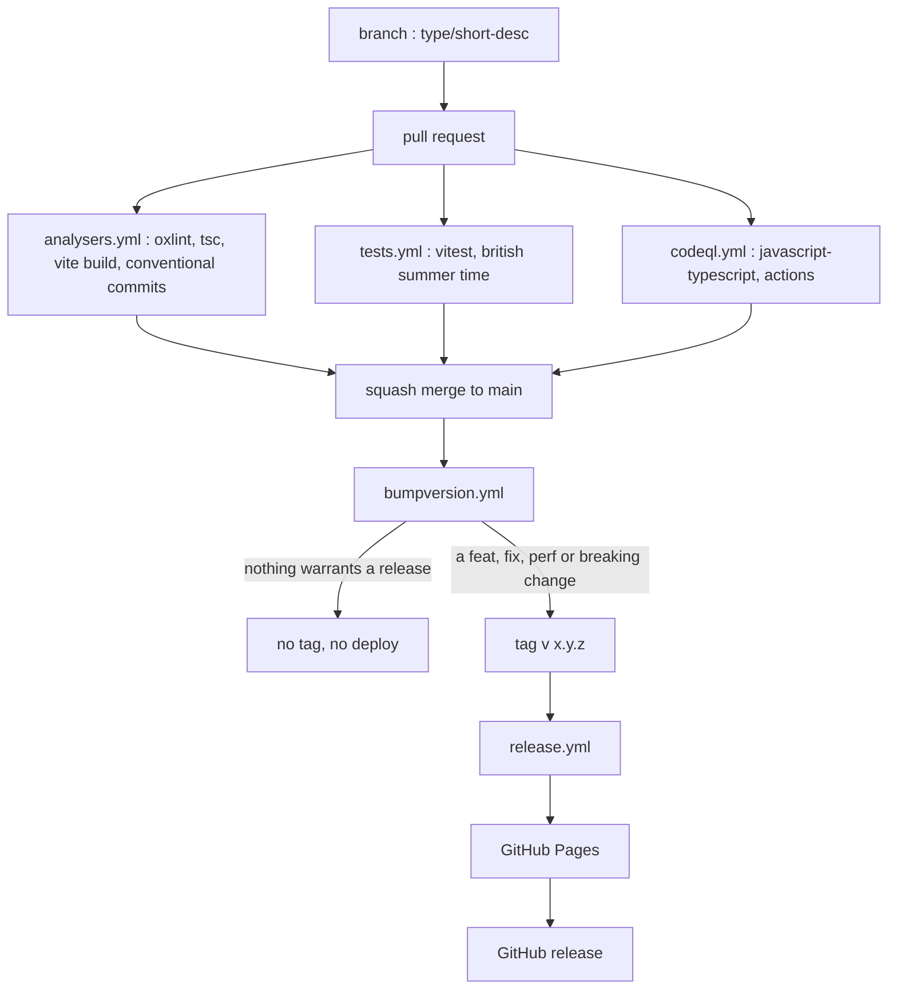
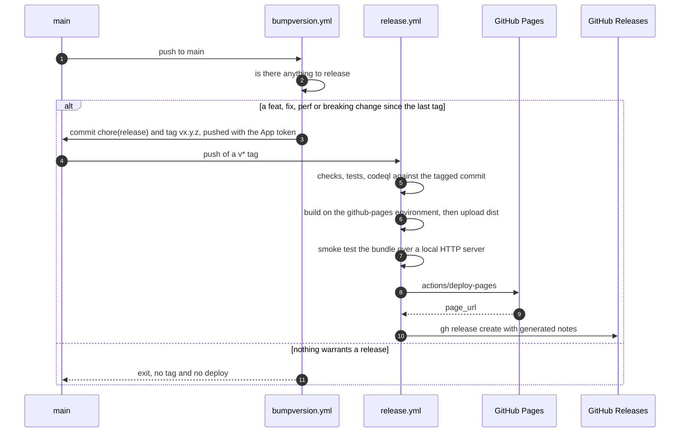

# Release process

How a change gets from a branch to `https://telly.na-n.xyz`. Everything here is
read out of `.github/workflows/`, `package.json`, `commitlint.config.js` and
`.versionrc.json`. Settings that live in GitHub rather than in the repository
are named as such at the end, and not guessed at.

## The branch model

`main` is the only long-lived branch, and it publishes itself. Work happens on a
branch named `<type>/<short-desc>`, from the same list of types the commits use:
`fix/guide-column-height`, `feat/station-idents`, `docs/branching`. Changes
arrive by pull request, and the merge method is squash, so a branch's own commit
subjects are discarded and the pull request title becomes the commit subject on
`main`.

The branch naming rule and the squash-only merge method are enforced by a
repository ruleset, which is a GitHub setting rather than a file here. See
[CONTRIBUTING.md](../../CONTRIBUTING.md) for what it refuses.

## The commit convention

[Conventional Commits](https://www.conventionalcommits.org), configured in
`commitlint.config.js`:

- `extends: ['@commitlint/config-conventional']`.
- `type-enum`: `build`, `chore`, `ci`, `docs`, `feat`, `fix`, `perf`,
  `refactor`, `revert`, `style`, `test`.
- `header-max-length`: 100. CONTRIBUTING asks for 72; the check refuses at 100,
  which is where Dependabot's grouped titles sit.
- `body-max-line-length`: 80.

Because the merge is a squash, **the pull request title faces this rule**, and
it is the title the `conventional commits` job checks. That job pipes it into
`npx commitlint` and nothing else: individual commits on a branch are not
checked by CI, because nothing they say survives the merge. The type in that
title is also what chooses the next version number, so a change filed under the
wrong type ships under the wrong one.

The title reaches the shell as the environment variable `TITLE` rather than
being interpolated into the `run:` body, because `${{ }}` pasted into a script is
executed. That threat is T20 in [threat-model.md](threat-model.md).

Dependabot writes conventional titles of its own: `.github/dependabot.yml` sets
`prefix: build` for runtime dependencies, `prefix-development: chore`, and
`prefix: ci` for actions, so its pull requests arrive mergeable.

## The gates, and which workflow runs each

Three workflows run on `push` to `main`, on `pull_request`, and on
`workflow_call`. The last is how `release.yml` re-runs the same workflows
against a tagged commit rather than a copy of them. Every job in `tests.yml` and
`analysers.yml` checks out, sets up Node from `.nvmrc` and installs with
`npm ci`; the CodeQL jobs check out but neither set up Node nor install, since
`build-mode` is `none`. Every action
used is pinned to a commit SHA, a tag being a moving pointer somebody else
controls.

| Workflow | Job (`name:`) | What it runs |
|---|---|---|
| `tests.yml` | `vitest` | `npx vitest run --coverage` |
| `tests.yml` | `british summer time` | `npm run test:dst`, which is `TZ=Europe/London vitest run --config vite.dst.config.ts` |
| `analysers.yml` | `oxlint` | `npm run lint` |
| `analysers.yml` | `tsc` | `npm run typecheck` (`tsc -b --noEmit`), then a step comparing the major in `.nvmrc` with the major of the `@types/node` range and failing if they differ |
| `analysers.yml` | `vite build` | `npx vite build` |
| `analysers.yml` | `conventional commits` | `echo "$TITLE" \| npx commitlint`, on `pull_request` events only |
| `codeql.yml` | `Analyze (javascript-typescript)` | CodeQL init and analyze, `build-mode: none` |
| `codeql.yml` | `Analyze (actions)` | the same over the workflow files, which run with a token |

`npm run test:ci` is the local composite: `vitest run --coverage && npm run
test:dst`. CI splits those two halves into separate jobs, so a red check names
which half broke. The two are separate for a reason: the runner is UTC, where
the clocks never change, so the clocks-change suite needs its own zone and is
excluded from the ordinary run.

CodeQL also runs on a schedule, `cron: "41 4 * * 2"`, and the workflow's own
header records that GitHub's default CodeQL setup must be off in repository
settings or the analyze step fails, since the two cannot run together.

`npm run build` is `npm run typecheck && vite build`; the `vite build` job runs
the bundler alone, and the typecheck is its own job, because Vite strips types
without checking them.

Coverage is collected by the `vitest` job and reported (`text` and `lcov`). No
threshold is configured in `vite.config.ts`, so coverage never fails a build.

## Versioning

`commit-and-tag-version` (`^13.2.1` in `package.json`), driven by `bumpversion.yml` on every push to
`main`, with `concurrency: bump` and `cancel-in-progress: false`.

The job is skipped when the head commit message starts with `chore(release):`,
because the bump is itself a push to `main` and would otherwise loop. Before
bumping, the `is there anything to release` step reads the commits since the
last tag and looks for a `feat`, `fix` or `perf`, a `!` breaking marker, or a
`BREAKING CHANGE` footer. If there is none, the job says so and exits: a
docs-only merge produces no version, no tag and no deploy, which is a normal
outcome rather than a failure. `commit-and-tag-version` would otherwise cut a
patch release when nothing warrants one.

When there is something to release, `npx commit-and-tag-version` bumps the
`version` in `package.json`, writes `CHANGELOG.md`, commits
`chore(release): x.y.z` and tags `vx.y.z`; the last step pushes with
`git push --follow-tags origin main`.

`.versionrc.json` decides what the changelog says: `feat` becomes Features,
`fix` becomes Fixes, `perf` becomes Performance, `revert` becomes Reverts, and
`refactor`, `build`, `ci`, `chore`, `docs`, `style` and `test` are hidden. It
also sets `commitUrlFormat` and `compareUrlFormat` against
`https://github.com/coolhandle01/telly`.

The push is authenticated with a GitHub App installation token from
`actions/create-github-app-token`, using `vars.COMMITLINT_CLIENT_ID` and
`secrets.COMMITLINT_CLIENT_SECRET` on the `commitlint` environment, and the job
sets `git user.name` and `user.email` from the App slug and installation id.
The workflow's header records why that token is load-bearing rather than a
preference: GitHub does not fire workflows for pushes made with the default
`GITHUB_TOKEN`, so a bump authenticated that way would push the tag and
`release.yml` would never run.

## Tag, release, deploy

`release.yml` triggers on `push` of a tag matching `v*` and on nothing else, so
an accidental publish is not reachable from ordinary development.

The jobs, in order:

1. **`checks`, `tests`, `codeql`.** Reusable calls to `analysers.yml`,
   `tests.yml` and `codeql.yml`, left unnamed so the checks keep the names they
   answer to on a pull request. `codeql` is given `security-events: write`,
   `actions: read` and `contents: read`.
2. **`build`**, needing all three. It runs on the `github-pages` environment,
   because that is where the client ID lives, and runs `npm run build` with
   `VITE_YOUTUBE_CLIENT_ID` from `vars`. Then `actions/configure-pages`,
   `actions/upload-pages-artifact` with `path: dist`, and a second
   `actions/upload-artifact` named `dist` for the next job to pull down.
3. **`smoke`**, needing `build`. It downloads the `dist` artefact, serves it
   with `python3 -m http.server 8000`, and checks three things: the homepage
   title contains `telly`; the first `.js` file the document references is
   actually fetchable, since wrong asset paths render a blank page and still
   return 200 for the document; and `privacy/index.html` and `terms/index.html`
   both serve a page whose title contains `telly`.
4. **`publish`**, needing `smoke`. `actions/deploy-pages` with
   `pages: write` and `id-token: write`, on the `github-pages` environment,
   whose URL is the deployment's `page_url` output.
5. **`github-release`**, needing `publish`, with `contents: write`. It runs
   `gh release create "$TAG" --title "$TAG" --generate-notes` with
   `GH_TOKEN: ${{ github.token }}` and `TAG: ${{ github.ref_name }}`. It is last
   so a release only exists once the thing it names is live.

Every job's default permission is `contents: read`, set at the top of each
workflow; the wider permissions above are granted per job.

### What gates the deploy

Inside the repository, the gate is the `needs:` chain: nothing reaches
`publish` unless the analysers, the tests, CodeQL, the build and the smoke test
have all passed against the tagged commit.

Outside the repository, `build` and `publish` both declare the `github-pages`
environment, and `bumpversion.yml` declares `commitlint`. An environment can
carry protection rules of its own: required reviewers, a wait timer, a
deployment branch or tag restriction. Those rules are stored in GitHub
settings, not in any file here, so **whether a required reviewer gates this
deploy cannot be verified from the repository**. The environments exist and are
named; what they enforce has to be read in Settings.

## Mutation testing is not a gate

`stryker.config.json` and `npm run mutate` exist, and nothing in CI runs either:
no workflow mentions Stryker. Its `thresholds` are `high: 90`, `low: 75` and
`break: null`, and a null `break` means no mutation score fails the run even
when it is run.

So mutation testing is a local tool, used deliberately on the code you are
changing, and a poor score cannot block a merge or a release. How to run it
usefully, and why a very low score usually means a broken harness rather than a
bad suite, is in [testing.md](testing.md).

## The domain, and the headers it does not set

`public/CNAME` names `telly.na-n.xyz`. The matching DNS record is a CNAME at the
registrar: host `telly`, value `coolhandle01.github.io.`. Settings, Pages,
Custom domain has to hold the same name for GitHub to issue the certificate.
Tick **Enforce HTTPS** once its check passes.

The domain is a Google requirement rather than a hosting one. Google's
brand-verification page says to "Verify the ownership of your authorized domains
using the Google Search Console", and that "The privacy policy must be visible
to users, hosted within the same domain as your application's home page, and
linked to on the OAuth consent screen". `telly.na-n.xyz` is the homepage and
the privacy policy's domain. Sign-in runs from `https://telly.na-n.xyz` and from
the development server at `http://localhost:5173`, which the README's setup
adds to the OAuth client's authorised JavaScript origins.

The live response carries no `Content-Security-Policy`,
`Cross-Origin-Opener-Policy`, `Cross-Origin-Embedder-Policy` or
`Strict-Transport-Security` header (checked 26 September 2026), so the page has
MDN's default `Cross-Origin-Opener-Policy`, `unsafe-none`, and sign-in works on
it. Google's setup guide warns that, when FedCM is disabled, "Failing to set the
proper header breaks communication between windows, leading to a blank pop-up
window or similar bugs", so a `same-origin` value from a generic hardening
checklist is the one to avoid.

## Not verifiable from this repository

These are real parts of the process, configured in GitHub or at a registrar,
and no file here proves their state:

- **Environment protection rules.** Whether `github-pages` or `commitlint`
  requires a reviewer, imposes a wait timer, or restricts which branches and
  tags may deploy.
- **The repository ruleset**: branch protection on `main`, the branch-name rule,
  which checks are required, and squash as the only merge method. CONTRIBUTING
  describes all four; the ruleset itself is a setting.
- **The release App**: that it is installed on this repository, and that it has
  `contents: write`.
- **Variables and secrets**: `vars.VITE_YOUTUBE_CLIENT_ID`,
  `vars.COMMITLINT_CLIENT_ID`, `secrets.COMMITLINT_CLIENT_SECRET`. Their values
  are not in the repository and must not be.
- **GitHub Pages settings**: the source, the custom domain, and HTTPS
  enforcement, plus the DNS record behind `telly.na-n.xyz`. On 26 September 2026
  the Pages API reported `cname: telly.na-n.xyz`, `https_enforced: true` and
  `build_type: workflow`, and DNS answered `telly.na-n.xyz` with a CNAME to
  `coolhandle01.github.io`.
- **The OAuth client**: its authorised JavaScript origins and authorised
  domains, which are set in Google Cloud Console, and the Search Console
  verification of the domain.
- **CodeQL default setup being off**, which `codeql.yml` requires and which is a
  repository setting.
