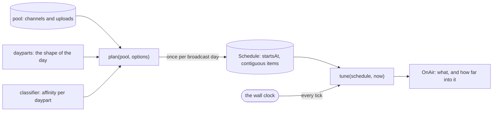
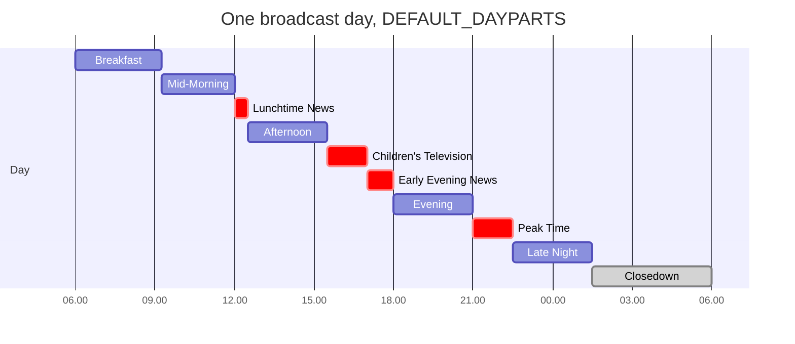
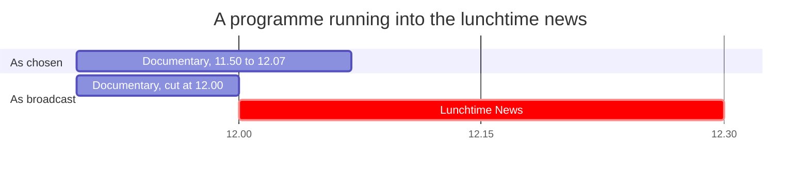
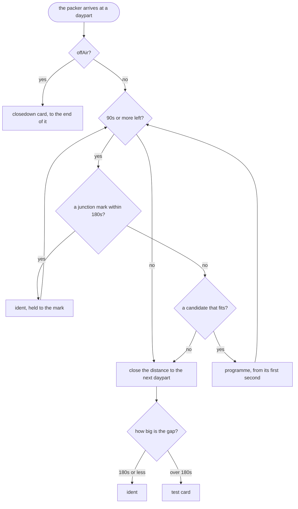

# Scheduling

The core, and the only part of the app with no browser in it. Two pure
functions, and wall-clock time is the only thing either of them takes from the
outside.



Neither reads a clock of its own. `plan` is handed the day to plan and `tune`
is handed the instant to answer for, which is what makes a whole broadcast day
provable in a millisecond.

## The broadcast day

06:00 → 06:00, because that is how real schedules are built and it keeps late
night contiguous instead of splitting it across two calendar dates.

Positions within the day are **integer offsets in seconds from that anchor**
(`src/domain/time.ts`), so scheduling arithmetic has no wrapping, no timezone
and no `Date` in it. `broadcastDayStart(now)` snaps an instant to its day's
06:00 and `secondsIntoDay(now, dayStart)` converts back. Only `tune` ever deals
in instants.

A day is **usually** `SECONDS_PER_DAY` = 86,400 seconds, and `assertCoversDay`
proves a planned day is contiguous and gapless — no overlaps, no holes, first
item at 0, last ending at the day's true length.

### Twice a year it is not 86,400

The UK clocks go forward at 01.00 on a Sunday in March and back at 02.00 on a
Sunday in October, and **both fall inside a broadcast day that began at 06.00
the previous morning**. So that day is 23 hours long in spring and 25 in
autumn, and `broadcastDayLength` is what the packer sizes it with.

Assuming 86,400 either way fails in both directions: in March the schedule's
last hour never plays, and in October the set runs an hour past the end of its
own schedule with nothing to put on, `tune` returning `undefined` from 05.00
until six on the one night of the year with an extra hour to fill.

The transition lands late in the broadcast day, so every daypart up to late
night is untouched and the closedown tail absorbs the difference.

The listings page reads its times off real instants rather than counting from
the anchor, for the same reason: six hours plus the offset is right on 363 days
and an hour out for the back half of the other two.

The ordinary suite cannot catch any of this: it runs wherever the machine is,
and CI is UTC, where British Summer Time does not exist. `*.dst.test.ts` files
are excluded from that run and have their own config and script,
`npm run test:dst`, which pins `TZ=Europe/London`. The first test in the file
asserts the timezone, because without it the rest is a confident no-op.

## Dayparts are data

`DEFAULT_DAYPARTS`, which is one station's day and the shape the others are
variations on:



The axis is one broadcast day, 06.00 to 06.00, and the day it belongs to is
whichever one began at that first 06.00. Red is a junction, which starts at its
appointed second; grey is off air and carries no programmes. Peak Time opens on
the watershed, and it and Late Night are the only parts of this day
age-restricted material may go out in.

```ts
interface Daypart {
  id, name, startMin, endMin, junction,
  offAir?, afterWatershed?, stripped?
}
```

`DaypartId` in `src/domain/daypart.ts` is the vocabulary, and each station
supplies its own arrangement of it. The shape of a day is an argument rather
than a constant, so a second channel is a different `Daypart[]` and not a
different program. The five the app ships are in [stations.md](stations.md).

`offAir` and `afterWatershed` are the two flags the diagram is coloured by. The
third, `stripped`, prints as one line in the listings however many items are in
it.

## The junction rule

**A junction daypart starts at its appointed second no matter what, and a
programme that would run into one is cut short. Everything else may overrun and
push the day along.**



The overrun is inside `maxOverrunSec`, so the programme was offered and taken;
`truncateTo` then cuts the tail off it at the junction. The front of it played
as planned, so `videoStartSec` stands and only the end is lost.

One rule turns the packer from a matter of taste into a defined problem, and it
is what being taken off air to go over to the news feels like.

Note the asymmetry: a junction is only guaranteed to *start* on time. It may
itself overrun into the next non-junction daypart — which is precisely what news
does.

## Classification

`src/schedule/classify.ts` answers one question: *how well does this video suit
each daypart?* — as `Affinities`, a **partial** map of `DaypartId -> 0..1`.

Partial on purpose. An absent daypart means "no judgement", which a caller
cannot confuse with a confident zero. That distinction stops a scoring bug from
quietly filling the evening with three-minute clips.

Three things are filtered out before any of this, at plan time rather than
discovered on air (`isEligible`): a **live stream** has no duration to schedule
against, an **unembeddable** video can only ever disappoint someone, and a
video reporting **no duration at all** is almost always a stream that has just
finished.

That last one matters more than it looks. A stream that has ended drops its
`liveBroadcastContent` back to `none` while YouTube is still processing the
recording, and in that window it plays as YouTube's own *"this live event has
ended"* card: inside the iframe, with no error event, which is the failure mode
this app is built around. So liveness is read from two places. Anything
carrying `liveStreamingDetails` without an `actualEndTime` has not finished,
whatever the snippet says. The part costs no extra quota, because parts are
free within a call.

`HeuristicClassifier` works cheapest-signal-first:

1. **Duration.** The strongest signal, because a duration tells you what a video
   is *for*. Each daypart has a band — breakfast 1–5 min, afternoon 60–150 min,
   late night 60–240 min — with the fit falling linearly to zero across a
   10-minute margin either side. Closedown has no band and therefore never takes
   a programme.
2. **Category.** YouTube's News & Politics (`25`) is a hard gate into the two
   news dayparts; a news video keeps only a quarter of its affinity elsewhere.
3. **Title keywords**, word-bounded on purpose — "mixture" is not a mix and
   "Newsdesk" is not news.
4. **Channel habit.** A channel with at least three schedulable uploads gets a
   median duration, and videos that match their channel's habit get a bonus.

**Duration is a gate, not just a score.** A video whose length does not fit a
daypart at all gets no affinity for it, and no keyword or channel habit can put
it there. Without the gate, a thirty-second short with the word "live" in its
title scores 0.2 for late night — nothing from its duration, all of it from the
word — and goes out between two feature-length programmes.

`Classifier` is an interface. `OverridingClassifier` decorates any
implementation with per-channel pins, and `StationClassifier`
([stations.md](stations.md)) is the one the app runs on.

## Packing

`plan(pool, options)` (`src/schedule/plan.ts`) takes the dayparts in order and
does one thing with the time in front of it. No clock, no `Math.random`, no
I/O: the same pool and the same options give the same schedule every time,
which is what lets the tuner treat the day as a *fact* rather than a decision.



The end of the day is cut the same way a junction is, and on two days a year it
is not where the arithmetic would put it.

Candidates are ranked on affinity, adjusted by:

- **Recency** — a 7-day half-life, so today's uploads outweigh last month's. An
  upload whose date will not parse is treated as a year old: old, but not
  disqualified.
- **Junction marks** — an ending near :00, :15, :30 or the next :00 is worth up
  to 35% more. Television ends on the quarter hour; this is why the schedule
  *feels* right even when nothing forces it to.
- **Overrun** — appeal decays as the overrun grows, and anything over ten
  minutes past its daypart is not offered at all. Real schedules run over; they
  do not run over by half an hour.
- **Jitter** — seeded (`DEFAULT_SEED = 1967`), so it breaks ties between equally
  good programmes without breaking determinism.
- **Freshness** — a second showing is worth a fifth of a first. A programme may
  go out twice in a day, at least four hours apart, and only once nothing new
  will fit; the second is marked `repeat`. Two uploads of one channel with the
  same name count as one programme whatever their ids say.

Whatever is left over becomes filler, and the vocabulary is three words wide:
card, ident, closedown. A gap of three minutes or less is the station's ident,
which is what an ident was for; anything longer is a test card. A daypart with
nothing eligible in it takes the `no` branch on its first pass and fills
entirely with card. A station that has run out is showing the card, which is
both the honest outcome and the thematically correct one.

## Tuning

`tune(schedule, now)` (`src/broadcast/tune.ts`) binary-searches the items for
the half-open interval `[startSec, endSec)` containing the instant, and returns
what is on air — including how far into it we are:

```ts
offsetSec: content.videoStartSec + (sec - item.startSec)
```

That line is the app. A programme is never started; it is joined in progress.

Half-open matters: at the exact second a programme ends, you are in the next
one, not ambiguously in both.

`nowAndNext` returns the pair for the listing.

## Looking at another hour

Most of what a schedule does happens at hours nobody is awake for, and the set
has no control that jumps to them. It does not need one. `SystemClock` is the
only thing in `src/` that calls `new Date()`, so "now" is an argument
everywhere else, and a test supplies it:

```ts
const clock = new FakeClock(new Date(2026, 8, 9, 1, 40))
render(<App clock={clock} />)
act(() => clock.set(new Date(2026, 8, 9, 11, 58)))
```

`FakeClock` (`test/support/fakeClock.ts`) implements `Clock` and ticks its
subscribers from `set()`, so a junction arrives, a programme ends and the card's
clock counts on, all without waiting and without a timer.

There was a `?at=` query parameter that shifted a live clock by an offset. It is
gone. It was a second mechanism for something the seam already did, it was a
public input on a deployed site, and it cost two bugs: an unbounded offset that
overflowed `Date` and took the schedule and the guide with it, and a window that
did not account for the 23 and 25 hour days. A parameter that only developers
use does not need to ship to viewers.
