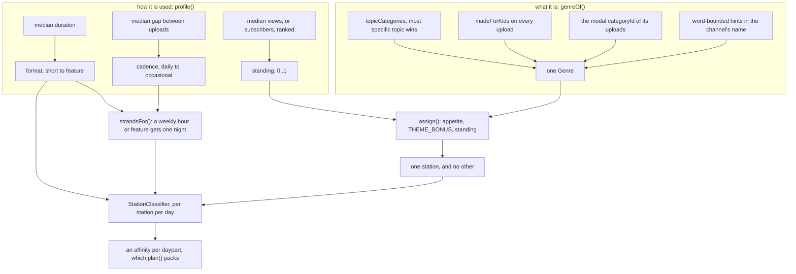
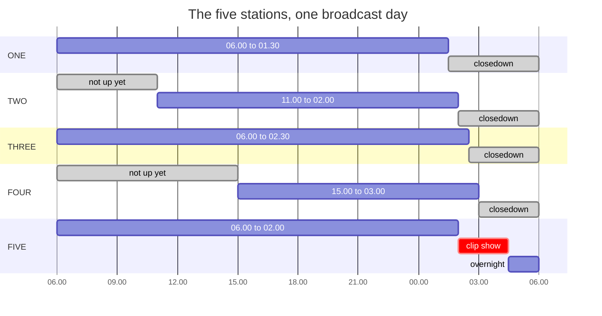

# Stations

Six keys on the fascia and five broadcasters behind them. `src/programming/`
holds the editorial policy: what each station is, which subscriptions belong to
it, and what it puts on at nine o'clock on a Thursday.

It sits on top of `src/schedule/`, which is a general packer and knows nothing
about any of this. `plan(pool, options)` takes a pool, a shape of day and a
classifier. `programming/` supplies all three, five times over.

## What the API is asked for

Three calls were already being made. YouTube documents each list call as 1
unit, whatever parts it asks for, so the fields the policy needs come for
nothing.

| Call | Parts | What it gives |
|---|---|---|
| `channels.list` | `contentDetails,topicDetails,statistics` | the uploads playlist, the channel's topics, its subscriber count |
| `videos.list` | `contentDetails,status,snippet,statistics,liveStreamingDetails` | duration, age rating, made-for-kids, category, views |

`topicDetails.topicCategories` is the important one. It is YouTube's own
judgement of what a whole channel is about, as a list of Wikipedia URLs, and it
is steadier than any single video's category: an uploader picks a category per
upload, but a channel filed under `Humour` is a comedy channel every week of
the year. Only the last path segment is kept, percent-decoded:
`https://en.wikipedia.org/wiki/Video_game_culture` becomes
`Video_game_culture`.

`contentDetails.contentRating.ytRating` and `status.madeForKids` are the
watershed as data. They are the only judgements of their kind the API makes,
and they are taken at face value.

## From a subscription to a time of day

Every section below is one box of this:

Genre decides which station a subscription goes to. Length, how often it turns
up and how well it is watched decide what time of day it goes out at.

## Genre

`genre.ts` maps all of that onto the vocabulary a schedule is built from:
`news`, `factual`, `society`, `arts`, `film`, `comedy`, `entertainment`,
`music`, `sport`, `gaming`, `lifestyle`, `food`, `motoring`, `nature`,
`travel`, `children`.

YouTube sorts by where a video came from. A schedule sorts by what it is for
and who is likely to be in the room. The table is the translation.

`genreOf(channel, videos)` reads, in order:

1. a channel whose every upload is `madeForKids` is `children`, whatever else
   it is about, because that decides when it may go out rather than what it is
   like;
2. the most specific of the channel's topics. A comedy channel carries
   `Entertainment` as well as `Humour`, because one is the parent of the other,
   so each topic has a specificity and the leaf wins;
3. the genre most of its uploads are filed under, iterated in a fixed genre
   order so a tie resolves the same way every time;
4. word-bounded hints in the channel's name. A newsagent is not a news
   programme;
5. `entertainment`, which is where an unlabelled programme goes.

## Profile

`profile(pool)` reads the uploads once and returns a `Subscription` per
channel: what a controller knows about a supplier before deciding what to do
with it.

- **Cadence** (the median gap between uploads) says how it is used. `daily`
  is a strip, across the week. `weekly` is a strand, on one night of it.
  `occasional` fills in. Median rather than mean, so one holiday or one day a
  channel posted four times does not change what the channel is.
- **Format** (the median duration, as a slot) says how long. `short` under
  65 seconds, then `segment`, `half-hour`, `hour`, `feature`. These are slots
  and not running times: a half-hour has never held thirty minutes, so a
  thirty-four minute programme is a half-hour and a seventy-minute one has
  stopped being an hour.
- **Standing** says whether it has earned peak time. It is a rank within the
  pool, not a view count: the figure is hidden whenever an uploader hides it
  and spans three orders of magnitude when it is not, so only the ordering is
  usable. Median views where there are any, subscribers where there are not,
  and 0.5 for a channel with neither.
- **Restricted** and **forChildren** decide when it may go out at all.

## The five stations

A station is a taste and a set of opening hours. Everything else follows from
those two, which is why `stations.ts` is the whole of the policy and the rest
of the directory is machinery.

Grey is off air. Each station's `dayparts` tile its own day exactly, those
hours included, so the axis is the same 06.00 to 06.00 for all five. Five never
closes down, which is why the clip show exists: everything under 65 seconds in
the whole subscription list goes out between two and half past four.

| | Taste | Cards | Tuner |
|---|---|---|---|
| One | news, factual, society, nature | monoscope, bars | mid-travel |
| Two | factual, arts, comedy, music, food | electronic, monoscope, crosshatch | mid-travel |
| Three | entertainment, sport, lifestyle, motoring | bars, ident | mid-travel |
| Four | film, arts, society, comedy | crosshatch, electronic | 0.28 |
| Five | gaming, motoring, lifestyle, nature | ident, bars, electronic | 0.76 |

Preset six has no station behind it.

### Finding a station in the snow

Each preset on a set of this period had its own tuning slug behind the flap,
set once by whoever installed it. `stationAt` is where each station's carrier
sits in the tuner's travel. One, two and three are at mid-travel. Four and five
are not, so pressing them gives snow until the tuner is turned.

`picture()` measures both losses from the edge of the band rather than across
the whole dial. The colour goes a twentieth of a turn past the lock and the
picture goes three times later. Spread across the travel instead, a preset set
a fifth of a turn out comes up as a faintly speckled picture rather than as
snow.

Preset six differs in kind: there is no carrier at any setting, so `NO_SIGNAL`
holds the snow at full whatever the viewer does.

### Idents

Each station has a symbol, a ground and an ink. It goes up between programmes,
held for the minute or two it takes to bring the next one onto the hour or the
quarter: the packer looks ahead to the next junction mark, and reaches for it
whenever it is within three minutes. More than that is a real gap, which is the
card's job.

The five marks are five mechanisms rather than five colours of one: a sphere
whose meridians sweep, a numeral turning into its rule, a chevron assembling, a
figure gathering out of four blocks, an orbit of dots. That is what made an
ident recognisable in the second before the name appeared. None reproduces any
broadcaster's mark.

Idents are not printed in the listings. A paper printed programme times, not
the two minutes of station symbol before one, so the line above absorbs them.

## Dealing the subscriptions out

`assign()` gives every subscription exactly one home. A channel that turns up
on all five is on none of them, and tuning around has to mean something.

The cost is honest. Divide thirty subscriptions five ways and each station has
six, so there will be gaps, and gaps are what the test card is for.

It is a draft, not an auction. Settling the keenest claims first sounds fair
and is not: two stations a tenth of a point apart on a genre are not equally
served by it, and the keener one takes every channel of that genre before the
other gets a look in. Each station picks in turn instead, in an order that
snakes (1,2,3,4,5 then 5,4,3,2,1), so picking last in one round is picking
first in the next.

Two rules sit around the draft:

- A station pays `THEME_BONUS` over the odds for a genre it has given a night
  to, or it arrives at Thursday with nothing to put on and the night is a night
  in name only.
- Channels whose format is `short` skip the draft entirely and go to whichever
  station has the clip show. They are not programme suppliers and neither want
  nor deserve a share of anybody's evening.

## What goes where

`StationClassifier` is built per station per day, because half the decision
depends on which day it is.

Three gates run first. They are not preferences:

- nothing age-rated goes out before nine, and nothing from a restricted
  supplier does either;
- nothing `madeForKids` goes out after six;
- a short goes in the clip show and nowhere else, and nothing else goes in the
  clip show.

Then two judgements are multiplied. The **slot** says when: a cookery programme
belongs to the morning and a film to the evening on any channel that carries
either, and `slots.ts` holds that for every daypart along with the lengths that
fit and how much being well watched counts there. The **station** says whether,
from its own appetite for the genre. A genre the slot has no opinion about gets
`BASELINE_WANT` rather than zero, because a station with one kind of programme
and a whole day to fill still has to fill it.

On top of that:

- **Themed nights.** A theme lifts what the night is for and pushes down what
  it is not. A night that still shows whatever came to hand is not a night with
  a habit.
- **Strands.** A weekly supplier of hours or features gets one night and one
  slot, dealt round the week so four strands are four different nights. It is
  worth a great deal in its own slot and little outside it; without the second
  half it goes out on the first day of the week with room for it and stops
  being a series.

The result is scaled by the largest score the whole model can produce rather
than clipped at one. Clipping loses the ordering exactly where it matters most:
a series on its own night and a comedy on comedy night both run past one, and
the packer could no longer tell them apart.

## Repeats

A station with seven suppliers and nineteen hours cannot fill them with new
material. What television did about that was show things again, and the
afternoon repeat of last night's documentary was the schedule rather than a
failure of it.

`plan()` allows a programme two showings a day, at least four hours apart, and
scores the second at a fifth of the first, so it goes out again only when
nothing new scores higher. The second is marked `repeat` and the listings print
`(R)`.

Two uploads of one channel with the same name are held four hours apart like
one programme, whatever their ids say. Two channels sharing a name is a coincidence and is left alone.

## Determinism

Everything here is pure. The same pool and the same date give the same five
schedules, on every machine and every run, which is what lets the tuner treat a
day as a fact rather than a decision.

The seed varies per station and per day: per station, or five schedules drawing
on five different sets of channels would still make their choices in the same
order; per day, or a station with a handful of suppliers would run the same
evening all week.
