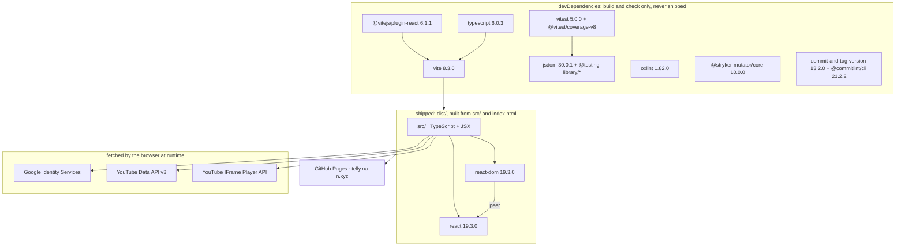

# Technologies

What the system is made of, where each piece is configured, and which version is
actually installed. Every version below is the resolved one from
`package-lock.json` (lockfileVersion 3); the range beside it is what
`package.json` asks for. A range and a resolution are different facts and both
are worth having: the range is the promise, the lockfile is what CI installs
with `npm ci`.

## Two runtime dependencies, and everything else

`package.json` has exactly two entries under `dependencies`, `react` and
`react-dom`. Every other package is a `devDependency`: a compiler, a bundler, a
test runner, a linter, or release tooling. None of them is in the shipped
bundle.

That is the architectural fact this page exists to make obvious. The browser
loads the bundle, React, and three Google endpoints. Nothing else.

## Language and type checking

| | |
|---|---|
| TypeScript | 6.0.3 installed, `~6.0.2` asked for |
| Configured by | `tsconfig.json`, `tsconfig.app.json`, `tsconfig.node.json` |
| Gate | `npm run typecheck` (`tsc -b --noEmit`), the `tsc` job in `analysers.yml` |

`tsconfig.json` is solution style: it has `"files": []` and references the other
two. `tsconfig.app.json` covers `src` (`target`/`lib` ES2023 plus DOM,
`module: esnext`, `moduleResolution: bundler`, `jsx: react-jsx`, `strict`,
`noUnusedLocals`, `noUnusedParameters`, `erasableSyntaxOnly`,
`noFallthroughCasesInSwitch`, `types: ["vite/client", "vitest/globals"]`).
`tsconfig.node.json` covers `vite.config.ts` alone, with `module: nodenext` and
`types: ["node"]`.

Because the root config is solution style, the gate has to be `tsc -b`. The
reasoning is argued in [testing.md](testing.md).

Dependabot is told not to open a TypeScript major, in `.github/dependabot.yml`.

## Runtime: Node, and the two numbers that differ

| | |
|---|---|
| `.nvmrc` | `24` |
| `package.json` `engines` | `^20.19.0 \|\| >=22.12.0` |
| CI | every job uses `actions/setup-node` with `node-version-file: .nvmrc` |

The `engines` range is the floor and it is the same range the installed
`vite@8.3.0` declares in its own `engines` field: Node 20.19+ or 22.12+. The
`.nvmrc` pin is higher, 24, and that is the version every workflow job runs,
since they all read the Node version from that file. So the repository supports
20.19 or 22.12 upwards, and is built and tested on 24 only.

`@types/node` (24.13.4 installed) describes the runtime rather than following
it, so the `tsc` job in `analysers.yml` carries a step, `the node types match
the pinned node`, which compares the major in `.nvmrc` with the major of the
`@types/node` range and fails the job if they differ. Dependabot is told not to
open a major on `@types/node` for the same reason.

One further floor, visible only in the installed package rather than in this
repository's manifests: `vitest@5.0.0` declares
`engines: ^22.12.0 || ^24.0.0 || >=26.0.0`. The test runner therefore will not
run on Node 20.19, even though `engines` here permits it. Everything CI does is
on Node 24, so nothing exercises that gap.

## Framework

React 19.3.0 and React DOM 19.3.0 (`^19.2.8` asked for), with types
`@types/react` 19.3.0 and `@types/react-dom` 19.3.0. JSX is compiled by
`@vitejs/plugin-react` 6.1.1, registered in `vite.config.ts`, with
`jsx: react-jsx` in `tsconfig.app.json`.

The React tree, and which component is allowed to know what, is in
[components.md](components.md).

## Build tool

Vite 8.3.0 (`^8.3.0`), configured by `vite.config.ts`:

- `base: './'`, so assets are referenced relatively.
- `resolve.alias`: `@` resolves to `./src`.
- Plugins: `@vitejs/plugin-react`, and `publicDirectoryIndex`, a plugin defined
  in that same file. It serves `public/<dir>/index.html` for a request to
  `public/<dir>/`, in both the dev server and `vite preview`, which is how the
  static host answers and therefore how `/privacy/` and `/terms/` behave
  locally.
- `index.html` is the entry. It carries the Content Security Policy as a
  `<meta http-equiv>`, because GitHub Pages sets no response headers.

`npm run build` is `npm run typecheck && vite build`. Vite strips types without
checking them, so the build is not a type gate and the typecheck runs first.

## Test runner

Vitest 5.0.0 with `@vitest/coverage-v8` 5.0.0. The test configuration shares
`vite.config.ts` with the build, so a test cannot pass against a module graph
the bundle will not produce: same aliases, same plugins.

| | |
|---|---|
| Environment | `jsdom` (jsdom 30.0.1) |
| Globals | on, `describe`/`it`/`expect` without imports |
| Tests | `include: ['test/**/*.test.{ts,tsx}']` |
| Setup | `test/support/setup.ts` |
| Mocks | `restoreMocks: true` |
| Coverage | provider `v8`, reporters `text` and `lcov`, `include: ['src/**/*.{ts,tsx}']` |
| Excluded from the ordinary run | `node_modules`, `dist`, `.stryker-tmp`, and `**/*.dst.test.ts` |

No coverage thresholds are configured. Coverage is measured and reported; it
does not fail a run.

The clocks-change suite has a second config, `vite.dst.config.ts`, which spreads
the base config and replaces `include` with `src/**/*.dst.test.ts`, replaces
`exclude`, and disables coverage. It is run by `npm run test:dst`, which sets
`TZ=Europe/London`.

Component tests use `@testing-library/react` 16.3.3,
`@testing-library/jest-dom` 7.0.1 and `@testing-library/user-event` 14.6.7. The
posture, the seams and jsdom's blind spot are in [testing.md](testing.md).

## Linter

oxlint 1.82.0 (`^1.79.0`), configured by `.oxlintrc.json`: plugins `react`,
`typescript` and `oxc`; `react/rules-of-hooks` as an error;
`react/only-export-components` as a warning with `allowConstantExport`; and
`.stryker-tmp/**`, `reports/**` and `dist/**` ignored. Run by `npm run lint` and
by the `oxlint` job in `analysers.yml`.

## Mutation tester

Stryker: `@stryker-mutator/core` 10.0.0, configured by `stryker.config.json`,
run by `npm run mutate`.

- `testRunner: "command"`, with `commandRunner.command` set to
  `npx vitest run $MUTATION_TESTS --silent=true`. `@stryker-mutator/vitest-runner`
  10.0.0 is installed but the config does not select it; why, is in
  [testing.md](testing.md).
- `coverageAnalysis: "off"`, `concurrency: 2`, `timeoutMS: 60000`.
- `mutate` covers `src/**/*.ts` and `src/**/*.tsx` less `src/main.tsx`.
- `thresholds`: `high` 90, `low` 75, `break` **null**.

`break: null` means no score fails the run, and no workflow invokes Stryker at
all. See [release-process.md](release-process.md).

## Release tooling

`commit-and-tag-version` 13.2.0 with `.versionrc.json`, and `@commitlint/cli`
21.2.2 with `@commitlint/config-conventional` 21.2.2 and `commitlint.config.js`.
Both are described in [release-process.md](release-process.md).

## What it talks to at runtime

Three Google endpoints, all loaded by the browser, none of them proxied by
anything of ours, because there is nothing of ours to proxy through.

| Service | URL | Where |
|---|---|---|
| Google Identity Services | `https://accounts.google.com/gsi/client` | `src/library/googleTokenProvider.ts`, as `GIS_SCRIPT_URL` |
| YouTube Data API v3 | `https://www.googleapis.com/youtube/v3` | `src/library/youTubePoolSource.ts`, as `API_BASE` |
| YouTube IFrame Player API | `https://www.youtube.com/iframe_api` | `src/player/youtubePlayer.ts`, as `API_URL` |

GIS hands the page a short-lived access token for the scope
`https://www.googleapis.com/auth/youtube.readonly` and no refresh token; the
token stays in memory. The Data API is called with `channels.list`,
`subscriptions.list`, `playlistItems.list` and `videos.list`, batched 50 ids at
a time. The IFrame API is loaded once and creates the player in an iframe.

The details are their own documents: [tokens.md](tokens.md) for sign-in and
expiry, [google.md](google.md) for the Data API pipeline and its quota,
[player.md](player.md) for the IFrame API and its failure modes.

The set of origins the browser may reach is fixed in `index.html` by the CSP
meta tag: `script-src` allows `'self'`, `https://accounts.google.com` and
`https://www.youtube.com`; `connect-src` allows `'self'`,
`https://www.googleapis.com` and `https://accounts.google.com`; `frame-src`
allows `https://www.youtube.com`, `https://www.youtube-nocookie.com` and
`https://accounts.google.com`; `default-src` is `'none'`.

Browser storage is not a service: the pool cache is IndexedDB, in the browser,
keyed to whose data it is. See [google.md](google.md).

## Hosting

GitHub Pages, at `telly.na-n.xyz`. The custom domain is `public/CNAME`, which
holds that name and is published with the site. `base: './'` in `vite.config.ts`
keeps asset paths relative. GitHub Pages offers no control over response
headers, which is why the CSP is a meta tag; the reasoning, including why the
default `Cross-Origin-Opener-Policy` is the one the sign-in popup needs, is in
the [README](../../README.md).

The DNS record, the Pages custom-domain setting and the HTTPS enforcement are
GitHub and registrar settings rather than files here. They are described in the
README and cannot be verified from the repository.

## Build-time configuration

One variable, `VITE_YOUTUBE_CLIENT_ID`, documented in `.env.example`.

**`import.meta.env.VITE_*` is inlined into the bundle at build time and is
therefore public**: anyone who views source can read it. A client ID is a public
identifier by design, so it may live there. A client secret or an API key must
never be given a `VITE_` name, and an access token is never configured at all:
it is fetched at runtime and kept in memory.

`.env.example` is the only env file in the repository. `.gitignore` excludes
`.env` and `.env.*` with `!.env.example` as the one exception, so a real
`.env.local` never arrives here. Left unset, there is nothing to sign in to and
nothing to schedule, and the set shows the no-service-configuration fault card.

In CI the value comes from `vars.VITE_YOUTUBE_CLIENT_ID` on the `github-pages`
environment, read by the `build` job in `release.yml`. Its value is a GitHub
setting and is not in the repository.

## Where each thing is configured

| Concern | File |
|---|---|
| Dependencies and scripts | `package.json` |
| Resolved versions | `package-lock.json` |
| Node version for CI and local | `.nvmrc` |
| Node floor | `engines` in `package.json` |
| Compiler | `tsconfig.json` and the two it references |
| Bundler, dev server, preview | `vite.config.ts` |
| Vitest, ordinary run | `test` in `vite.config.ts` |
| Vitest, clocks-change run | `vite.dst.config.ts` |
| Lint | `.oxlintrc.json` |
| Mutation testing | `stryker.config.json` |
| Commit and pull request title rules | `commitlint.config.js` |
| Changelog sections and links | `.versionrc.json` |
| Build-time variable | `.env.example`, and `vars` on the `github-pages` environment |
| CSP, title, entry script | `index.html` |
| Custom domain | `public/CNAME` |
| Dependency updates | `.github/dependabot.yml` |
| Workflows | `.github/workflows/` |

## Not verifiable from this repository

- The value of `vars.VITE_YOUTUBE_CLIENT_ID`, and every other GitHub
  environment variable or secret.
- The DNS record for `telly.na-n.xyz`, the Pages custom-domain setting, and
  whether HTTPS enforcement is on.
- The Google Cloud project: which APIs are enabled, the OAuth client's
  authorised JavaScript origins, the consent screen and its test users.
