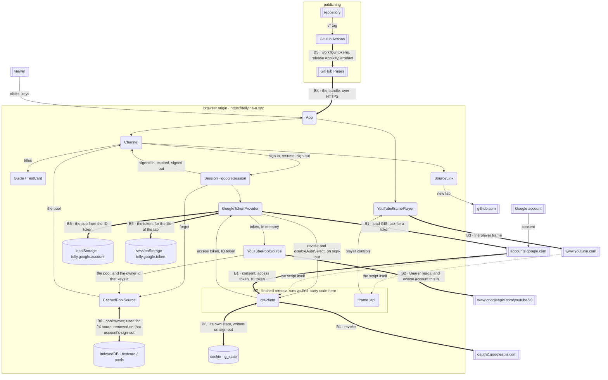

# Threat model

`telly` is a static bundle on GitHub Pages that holds a Google access token in
memory and in the tab's session storage, and reads one person's YouTube
subscriptions with it. There is no server
of ours: every boundary it has is a line between a browser tab and somebody
else's infrastructure, or between this repository and the machine that publishes
it.

This document models those lines and the threats that live on them. Elements
that sit entirely inside one trust boundary, `domain/`, `schedule/`,
`programming/`, `broadcast/`, which touch no browser API at all
([README.md](README.md)), carry no rows.

## The system, as data flows

Boxes with doubled sides are external entities, rounded boxes are processes, the
cylinder is a data store, and a boxed region is a trust boundary. A bold flow
crosses a boundary; a dotted flow is remote code arriving to run inside the
boundary it lands in.

- **External entities**: the viewer; the Google account and its consent; the
  YouTube Data API; the owners of the channels the viewer subscribes to; GitHub
  as host and as CI.
- **Processes**: `GoogleTokenProvider`
  ([src/library/googleTokenProvider.ts](../../src/library/googleTokenProvider.ts)),
  the `Session` seam over it
  ([src/library/session.ts](../../src/library/session.ts)),
  `YouTubePoolSource`, `CachedPoolSource`, `YouTubeIframePlayer`, the React tree,
  and **the two remote scripts that execute as first-party code in this origin**.
- **Data stores**: the IndexedDB pool
  ([src/library/indexedDbPoolStore.ts](../../src/library/indexedDbPoolStore.ts)),
  keyed per account; the account identifier in `localStorage`, which the app
  uses only as a sign-in hint; the access token in the tab's `sessionStorage`,
  which is a credential; the `g_state` cookie that the GIS script writes in
  this origin; the published bundle on Pages, the CI environments
  `github-pages` and `commitlint`.
- **Data flows**: consent and token; the ID token Sign In With Google returns,
  of which only `sub` is kept; the revocation that hands the grant back; API
  requests carrying `Authorization: Bearer`; API metadata back; the owner id
  that keys the cache; the cached pool; the bundle; the tag that triggers a
  release.

## The boundaries

| | Line | What crosses it |
|---|---|---|
| **B1** | browser origin ↔ `accounts.google.com` and `oauth2.googleapis.com` | the GIS script, the consent popup, the access token, the ID token, and the revocation that hands the grant back, which the GIS script posts to `oauth2.googleapis.com/revoke` |
| **B2** | browser origin ↔ `www.googleapis.com` | bearer-authenticated reads of subscriptions, channels, playlist items and videos |
| **B3** | browser origin ↔ `www.youtube.com` | the IFrame API script, and the player frame that plays the programme, on an origin `frame-src` permits |
| **B4** | browser ↔ GitHub Pages | the bundle itself, over HTTPS, at `https://telly.na-n.xyz` |
| **B5** | repository ↔ GitHub Actions | a `v*` tag, workflow tokens, the release App's private key, and the artefact that becomes the site |
| **B6** | page session ↔ browser storage | the subscription pool in IndexedDB, filed under `pool:<owner id>`, used for 24 hours and kept until a fresh load replaces it, that account signs out, or the browser's data for the site is cleared or evicted; the account identifier in `localStorage`; the access token in this tab's `sessionStorage`, which is what carries a session across a reload; and the `g_state` cookie the GIS script writes |
| **B7** | this code ↔ the two remote scripts | `accounts.google.com/gsi/client` and `www.youtube.com/iframe_api` run **inside** the token-holding origin, unversioned and therefore without an integrity hash ([index.html:5-6](../../index.html)) |

B7 is the sharpest of them, because it is the only boundary the same-origin
policy does not draw for us: everything on the far side of B1–B3 is a separate
origin, and everything on the far side of B7 is this one.

## Threats

### B1: sign-in, and the token

| # | Element · STRIDE | Attacker capability | Impact | CWE | Response | Where it lives |
|---|---|---|---|---|---|---|
| T1 | Viewer identity · **S** | none | The app authenticates nobody. Identity is the Google session in the browser, and authorisation is a consent the viewer grants to a scope. The app learns two identifiers: `ownerId()`, the signed-in account's own channel id from `channels.list` with `mine=true`, which keys the cache; and the `sub` in the ID token Sign In With Google returns, which is kept as a sign-in hint (T32). | CWE-287 | **Transfer**: to Google Identity Services | `GoogleTokenProvider` in [googleTokenProvider.ts](../../src/library/googleTokenProvider.ts), `YouTubePoolSource.ownerId` in [youTubePoolSource.ts](../../src/library/youTubePoolSource.ts) |
| T2 | Consent flow · **S** | Hosts a page that presents the same public client ID | A consent granted on an attacker's page yields a token to that page. The client ID is public by design; the authorised-JavaScript-origins list on the OAuth client is what refuses the request. Sign-in runs from both `https://telly.na-n.xyz` and the development server at `http://localhost:5173`, which the README's setup adds to that list, so a page served from `http://localhost:5173` on a viewer's machine passes the check as well. | CWE-346 | **Transfer**: to Google's origin check on the OAuth client | [tokens.md](tokens.md), [release-process.md](release-process.md#the-domain-and-the-headers-it-does-not-set) |
| T3 | GIS script flow · **T** | Sits on the network between the browser and `accounts.google.com` | Arbitrary JavaScript in the origin that holds the token. The script URL is `https://` and fixed, and `script-src` names the host. | CWE-494 | **Mitigate** | `GIS_SCRIPT_URL` in [googleTokenProvider.ts](../../src/library/googleTokenProvider.ts), CSP at [index.html:10](../../index.html) |
| T4 | Token in the page · **I** | Runs any script in this origin | Read of the viewer's YouTube account until the token expires, at the lifetime Google gives it in `expires_in`. Google describes the scope as "View your YouTube account", and the token model issues no refresh token. `connect-src` permits only `'self'`, `https://oauth2.googleapis.com`, `https://www.googleapis.com` and `https://accounts.google.com`, which closes `fetch`, `fetchLater`, `XMLHttpRequest`, `WebSocket`, `EventSource`, `sendBeacon` and `<a ping>` to every other host. Apart from `form-action 'none'`, the policy sets nothing on navigation, so a script in this origin can still carry the token out in a URL by navigating or opening a window. The token's lifetime and its scope are what bound this threat; the policy narrows it. An expired token is dropped rather than kept as a fallback, and the app obtains a new one only from a click on the sign-in button. | CWE-522 | **Mitigate** | `#token`, `EXPIRY_MARGIN_MS`, `GoogleTokenProvider.getAccessToken` and `signOut` in [googleTokenProvider.ts](../../src/library/googleTokenProvider.ts); [index.html:14](../../index.html) |
| T35 | Token at rest · **I** | Has the unlocked machine, or runs code in this origin | The token is written to this tab's `sessionStorage` under `telly.google.token`, with the moment it expires, so that a reload keeps the session: the app obtains tokens only from a click on the sign-in button, and holding the token in memory alone signed the viewer out on every refresh. What is exposed is a bearer token for `youtube.readonly`, good until the lifetime Google gave it in `expires_in` runs out, readable by anything already running in this origin, which is the same reach it has over the token in the page (T4). Closing the tab clears the record, though a browser that restores the tab restores it too; a restored token past its expiry is dropped rather than adopted, and signing out removes it whatever the revocation answers. | CWE-522 | **Accept**: in this design the token is what carries a session across a reload; the window is the token's lifetime, or the tab's life if that ends first | `TOKEN_KEY`, `rememberToken`, `storedToken`, `resume` and `#discard` in [googleTokenProvider.ts](../../src/library/googleTokenProvider.ts), [tokens.md](tokens.md) |
| T37 | ID token · **I** | Runs any script in this origin at the moment of sign-in | Sign In With Google hands the page an ID token. Google's reference shows it carrying the account's `sub`, and able to carry its name, email address, picture and Google Workspace domain. `accountFromCredential` takes `sub` and nothing else; nothing else from the token is stored, shown or sent. A script already running in this origin sees what the callback sees. | CWE-359 | **Accept**: the same capability already holds the access token (T4) | `#identify` and `accountFromCredential` in [googleTokenProvider.ts](../../src/library/googleTokenProvider.ts) |
| T5 | GIS loader · **D** | Blocks the script: an extension, a firewall, an outage | Sign-in is impossible. The loader rejects instead of hanging, the failure is reported under the cabinet, and a failed `prepare()` does not stop the set coming on: signed out, it has no programmes to show and says so on the card. | CWE-703 | **Mitigate** | `loadGoogleIdentityServices` in [googleTokenProvider.ts](../../src/library/googleTokenProvider.ts), `sessionError` and the signed-out `source` in [Channel.tsx](../../src/ui/Channel.tsx), the `prepare()` effect in [App.tsx](../../src/App.tsx) |

### B2: the YouTube Data API

| # | Element · STRIDE | Attacker capability | Impact | CWE | Response | Where it lives |
|---|---|---|---|---|---|---|
| T6 | Request flow · **I** | Reads URLs: browser history, a referrer, a proxy log | A token in a query string is replayable until it expires. It travels in the `Authorization` header, and the error type is built from status, reason and message with no URL and no headers. | CWE-598 | **Mitigate** | `YouTubePoolSource#get` and `toApiError` in [youTubePoolSource.ts](../../src/library/youTubePoolSource.ts) |
| T7 | Video and channel metadata · **T** | Owns a channel the viewer subscribes to, and therefore its titles and tags | Titles reach the DOM as listing rows and as the caption on the test card. Both are React text children (`{entry.label}` and `{shape.text}`, plus an `aria-label` set as a prop) and `src/` contains no `dangerouslySetInnerHTML` and no `innerHTML` write. | CWE-79 | **Mitigate** | `{entry.label}` in [Guide.tsx](../../src/ui/Guide.tsx), `{shape.text}` in [TestCardSvg.tsx](../../src/testcard/TestCardSvg.tsx), the `label` prop on `Screen` in [Channel.tsx](../../src/ui/Channel.tsx) |
| T8 | Watershed metadata · **T** | Owns a subscribed channel, and declares `madeForKids`; YouTube declares `ytAgeRestricted` | A mis-declared video is scheduled before the watershed. The two flags are recorded as the API reports them and the scheduler acts on them. | CWE-807 | **Accept**: the API's judgement is the only age signal the app has, the viewer chose the subscription, and the watershed is read off the API in both directions ([stations.md](stations.md)) | `ageRestricted` and `madeForKids` in `YouTubePoolSource#describeVideos`, [youTubePoolSource.ts](../../src/library/youTubePoolSource.ts) |
| T9 | Quota · **D** | Holds a large subscription list, or reloads repeatedly | The daily allowance, which YouTube documents as 10,000 units, is spent and no pool loads. Each list call costs 1 unit. IDs are batched 50 to a call, the pool is used for 24 hours before it is fetched again, and quota reasons are classified as their own error. A full load is about 290 units for 200 subscriptions, of which the owner call is one. | CWE-770 | **Mitigate** | `batchIds`, `QUOTA_REASONS` in [youTubePoolSource.ts](../../src/library/youTubePoolSource.ts), `DEFAULT_POOL_TTL_MS` in [cachedPoolSource.ts](../../src/library/cachedPoolSource.ts) |
| T10 | Load loop · **D** | Deletes or privates one subscribed channel | One 404 playlist ends the whole load. `isFatal` is 401, 403, 429 and every `QuotaExceededError`; anything else costs that channel alone. | CWE-703 | **Mitigate** | `isFatal` and `YouTubePoolSource#listRecentVideoIds` in [youTubePoolSource.ts](../../src/library/youTubePoolSource.ts) |
| T30 | Load loop · **D** | Spends the per-minute rate limit, or the day's quota, part-way through the per-playlist loop | Every remaining playlist fails the same way and the load ends with an empty pool, which the screen reports as an empty subscription list. That was the behaviour until 429 and `QuotaExceededError` joined `isFatal`. A call the per-minute limit refuses is now repeated after waits of 1, 2, 4 and 8 seconds, each with up to a second of jitter; once those are spent, or on the first refusal for the day's quota, the load is abandoned. A run in which every playlist failed for any reason throws the first error it saw rather than returning nothing. | CWE-754 | **Mitigate** | `isFatal`, `RATE_LIMIT_BACKOFF_MS`, `YouTubePoolSource#get` and the `failures === playlistIds.length` throw in `YouTubePoolSource#listRecentVideoIds`, [youTubePoolSource.ts](../../src/library/youTubePoolSource.ts) |
| T31 | Error text · **I** | Reads the screen, or is shown a screenshot | Google's own message, the endpoint and the status code name internal detail a viewer cannot act on. They stay in the `Error`. `src/ui/faultMessage.ts` holds the sentences for a failure: `faultMessage` for a load that failed, `signInMessage` for a sign-in that produced no token, `signOutMessage` for a sign-out where one half did not happen. Each maps a typed field (`YouTubeApiError.status`, `SignInError.reason`, `SignOutError.revoked` and `.cleared`) to copy, with a test per sentence. `Channel.tsx` adds one sentence of its own, for a pool with nothing schedulable. No `error.message` reaches the screen. The one `console.*` call in `src/` is the development-build diagnostic in `App.tsx`, which carries no token; the production bundle does not contain it. | CWE-209 | **Mitigate** | [faultMessage.ts](../../src/ui/faultMessage.ts), `poolError` in [Channel.tsx](../../src/ui/Channel.tsx) |

### B3: the player frame

| # | Element · STRIDE | Attacker capability | Impact | CWE | Response | Where it lives |
|---|---|---|---|---|---|---|
| T11 | Player frame · **I** | none (YouTube, by construction) | Programmes play in a frame YouTube's IFrame API builds, on an origin `frame-src` permits (`www.youtube.com` or `www.youtube-nocookie.com`). A frame on another origin gets only the limited cross-origin access to this window that browsers allow, and none of this origin's storage, so it reads neither this DOM nor this token. What the player records about viewing is YouTube's. The app does not ask for YouTube's privacy-enhanced mode. | CWE-359 | **Transfer**: to YouTube, under the [YouTube Terms of Service](https://www.youtube.com/t/terms) and [Google's privacy policy](https://policies.google.com/privacy) | [index.html:15](../../index.html), [youtubePlayer.ts](../../src/player/youtubePlayer.ts) |
| T12 | Player · **D** | Pulls, privates or geoblocks a scheduled video; or blocks the API script | A frame that shows YouTube's own error page without firing `onError` would leave the screen black. A watchdog reports "no picture" after 8s, the card sits under every programme and is revealed when there is none, and a failed load rebuilds rather than latching. | CWE-390 | **Mitigate** | `DEFAULT_START_TIMEOUT_MS`, `#armWatchdog`, `#onError` and `#teardown` in [youtubePlayer.ts](../../src/player/youtubePlayer.ts), the `hasPicture` gate in [Channel.tsx](../../src/ui/Channel.tsx) |
| T13 | Player frame · **E** | Owns a subscribed channel, and thus what plays | The player is built with `controls: 0`, which YouTube documents as "Player controls do not display in the player"; `disablekb: 1`, "the player to not respond to keyboard controls"; and `playsinline: 1`, inline rather than fullscreen playback on iOS. It is also given `rel: 0`, which YouTube documents as "related videos will come from the same channel as the video that was just played", not as turning them off, and `modestbranding: 1`, which YouTube documents as deprecated with no effect. | CWE-1021 | **Mitigate** | `STRICT_TELLY_VARS` in [youtubePlayer.ts](../../src/player/youtubePlayer.ts) |

### B7: the two remote scripts in this origin

| # | Element · STRIDE | Attacker capability | Impact | CWE | Response | Where it lives |
|---|---|---|---|---|---|---|
| T14 | `gsi/client` and `iframe_api` · **T** | Changes what `accounts.google.com` or `www.youtube.com` serves | Either script runs as first-party code beside the token, in memory and in `sessionStorage`, with the origin's storage, cookies and DOM. Both are unversioned, so neither carries an SRI hash. CSP is the containment that remains, and it is partial: `default-src 'none'`, `script-src` pinned to `self` and those two hosts, `object-src 'none'`, `base-uri 'self'`, `form-action 'none'`, `connect-src` naming three hosts. It governs what is fetched, framed, submitted and loaded as script. Apart from form submission, it governs no navigation, so script running here reaches any host by navigating to it. The page's own navigations are three anchors to constants: the two legal pages, same-origin, and the source link. The policy ships in the built artefact as well as in source. | CWE-829 | **Accept**: Google already holds the token by virtue of issuing it; GIS is the route Google's token-model guide recommends over its older client-side guide; and the IFrame API is how the player reports its state and its errors | [index.html:5-19](../../index.html), `dist/index.html` |
| T15 | Response headers · **T** | none | The live site's response carries no `Content-Security-Policy`, `Cross-Origin-Opener-Policy`, `Cross-Origin-Embedder-Policy` or `Strict-Transport-Security` header (checked 26 September 2026), so the CSP travels in the document as a `<meta>` element. With no `Cross-Origin-Opener-Policy` header the document has the default, `unsafe-none`. Google's Sign In With Google setup guide says that, when FedCM is disabled, "Failing to set the proper header breaks communication between windows". | CWE-693 | **Accept**: the reasoning for leaving `Cross-Origin-Opener-Policy` and `Cross-Origin-Embedder-Policy` unset is recorded in google.md, *Verification* | [google.md](google.md), *Verification*; [release-process.md](release-process.md#the-domain-and-the-headers-it-does-not-set) |
| T16 | Outbound link · **I** | Controls the linked page | A page opened from this one could reach it through `window.opener`. MDN documents that `target="_blank"` on an `<a>` "implicitly provides the same `rel` behavior as setting `rel="noopener"`", which leaves `window.opener` null; the link also carries `rel="noreferrer noopener"` explicitly, and its `href` is a constant. | CWE-1022 | **Mitigate** | `SourceLink` in [SourceLink.tsx](../../src/ui/SourceLink.tsx), `SOURCE_URL` in [App.tsx](../../src/App.tsx) |

### B4: the hosted bundle

| # | Element · STRIDE | Attacker capability | Impact | CWE | Response | Where it lives |
|---|---|---|---|---|---|---|
| T17 | Published bundle · **T** | Serves content at `telly.na-n.xyz` | A substituted bundle runs on `https://telly.na-n.xyz`, an authorised origin for this client ID, so it can ask for tokens for this client ID from the real domain. The site is published only from a tagged release's artefact, and the custom domain is pinned in the repository. | CWE-494 | **Mitigate** | [release.yml:5-7](../../.github/workflows/release.yml), [:88-98](../../.github/workflows/release.yml), [public/CNAME](../../public/CNAME) |
| T18 | Domain · **S** | Claims the `telly` CNAME target, or the registrar account | Identical to T17, and from outside the repository. The DNS record, the Pages custom domain and `public/CNAME` all name the same host, and HTTPS is enforced on it. | CWE-350 | **Transfer**: to the registrar and to GitHub's custom-domain verification | [release-process.md](release-process.md#the-domain-and-the-headers-it-does-not-set) |
| T19 | Host logs · **I** | GitHub | GitHub's Pages documentation states that "the visitor's IP address is logged and stored for security purposes". The app sends this host nothing beyond requests for the site's own files: there is no backend, no analytics and no beacon. | CWE-359 | **Accept**: hosting is a static-file fetch and the record is GitHub's, under the [GitHub Privacy Statement](https://docs.github.com/en/site-policy/privacy-policies/github-general-privacy-statement) | [GitHub Pages: data collection](https://docs.github.com/en/pages/getting-started-with-github-pages/what-is-github-pages#data-collection) |

### B5: repository and CI

| # | Element · STRIDE | Attacker capability | Impact | CWE | Response | Where it lives |
|---|---|---|---|---|---|---|
| T20 | `commits` job · **E** | Opens a pull request, choosing its title | `${{ }}` pasted into a `run:` body is shell source, so a crafted title executes on the runner. The title reaches the shell as the environment variable `TITLE`, which is data. | CWE-94 | **Mitigate** | [analysers.yml:72-75](../../.github/workflows/analysers.yml) |
| T21 | Third-party actions · **T** | Moves a tag on an action's repository | Attacker code in the release runner, where the Pages id-token and the release App's key live. Every third-party `uses:` names a 40-character commit SHA; the only unpinned references are this repository's own reusable workflows. | CWE-829 | **Mitigate** | all of [.github/workflows/](../../.github/workflows/), e.g. [release.yml:35-36](../../.github/workflows/release.yml) |
| T22 | Workflow tokens · **E** | Executes a step, by T20 or T21 | Write access to the repository from a test runner. Each workflow declares `permissions: contents: read` at the top, and write is granted per job: `pages: write` and `id-token: write` on publish, `contents: write` on the release job alone, and `security-events: write` on the CodeQL job. | CWE-250 | **Mitigate** | [release.yml:9-10](../../.github/workflows/release.yml), [:90-92](../../.github/workflows/release.yml), [:105-106](../../.github/workflows/release.yml), [tests.yml:9-10](../../.github/workflows/tests.yml), [analysers.yml:9-10](../../.github/workflows/analysers.yml), [bumpversion.yml:18-19](../../.github/workflows/bumpversion.yml) |
| T23 | Release provenance · **S** | Pushes a `v*` tag | The live site changes. The release runs the same analysers, tests and CodeQL against the tagged commit before it builds; tags come from `bumpversion.yml` on a push to `main`, authenticated by a GitHub App installation token from `actions/create-github-app-token`; `/src/library/`, `/.github/` and `/SECURITY.md` have a named owner. | CWE-345 | **Mitigate** | [release.yml:15-26](../../.github/workflows/release.yml), [bumpversion.yml:10-12](../../.github/workflows/bumpversion.yml), [:29-38](../../.github/workflows/bumpversion.yml), [CODEOWNERS](../../CODEOWNERS) |
| T24 | Build inputs · **I** | Reads a build log or the artefact | The build reads one value, `vars.VITE_YOUTUBE_CLIENT_ID`, a public identifier held as a variable precisely because marking it secret would only hide it from the log. The App private key is a secret on the `commitlint` environment and is read by no other workflow. Vite inlines only `VITE_`-prefixed variables, and `.env` files are ignored by git apart from the example. | CWE-540 | **Mitigate** | [release.yml:41-43](../../.github/workflows/release.yml), [bumpversion.yml:25-33](../../.github/workflows/bumpversion.yml), the header comment on [createPoolSource.ts](../../src/library/createPoolSource.ts), [.gitignore:18-20](../../.gitignore) |
| T25 | npm dependency tree · **T** | Publishes a version of any package in the tree | Code execution during the build and code in the shipped bundle. Installs are `npm ci` against the committed `package-lock.json` with its integrity hashes, updates arrive weekly and grouped, and CodeQL analyses both `javascript-typescript` and `actions`. | CWE-1357 | **Mitigate** | [tests.yml:22](../../.github/workflows/tests.yml), [release.yml:40](../../.github/workflows/release.yml), [dependabot.yml](../../.github/dependabot.yml), [codeql.yml:28-33](../../.github/workflows/codeql.yml) |

### B6: browser storage, and the viewer's own inputs

| # | Element · STRIDE | Attacker capability | Impact | CWE | Response | Where it lives |
|---|---|---|---|---|---|---|
| T26 | IndexedDB pool · **I** | Has the unlocked machine, or runs code in this origin | The saved pool, filed under the owner's channel id: the subscribed channels' ids, names, topics and subscriber counts, and up to twenty uploads from each, with titles, durations, dates, categories, tags, view counts and flags. What is written is the pool and only the pool; no token reaches it, and a browser that offers no store gets television without a cache. Signing out removes that account's record. Without a sign-out the record stays until a fresh load replaces it or the browser's data for the site is cleared or evicted: the 24-hour TTL decides when a record is used, not when it is deleted. | CWE-312 | **Accept**: reading it requires the machine or the origin already, and it holds the subscription list and no credential | `toStored` in [cachedPoolSource.ts](../../src/library/cachedPoolSource.ts), `IndexedDbPoolStore` and `openPoolStore` in [indexedDbPoolStore.ts](../../src/library/indexedDbPoolStore.ts) |
| T27 | IndexedDB pool · **T** | Writes the origin's `pools` store | A forged schedule: titles and video IDs the viewer never subscribed to, played in the embed for up to a day. The forged fields reach the same escaped text sinks as T7, and a record stamped in the future with a number is distrusted. A record the store cannot read at all is a cache miss rather than a fault, and so is a record whose `videos` or `channels` is not an array. The items inside those arrays are not checked, so a forged record can make the day unplannable. That now costs one day's listings, not the receiver: `planStations` runs in a render, so the call is wrapped and a throw leaves the set on the air showing the card instead of reaching the root boundary. | CWE-20 | **Accept**: writing this store requires already running in this origin or holding the machine, at which point the pool is the smaller prize | `#isFresh` and `toPool` in [cachedPoolSource.ts](../../src/library/cachedPoolSource.ts), the `listings` memo in [Channel.tsx](../../src/ui/Channel.tsx), [FaultBoundary.tsx](../../src/ui/FaultBoundary.tsx) |
| T29 | The client as a whole · **R** | The account holder | Nothing here records what was read: the app keeps no log and there is no server to keep one. Any record of what a token did is Google's. Consent is revocable from the Google account's permissions page. | CWE-778 | **Accept**: every YouTube request the app makes is a read under `youtube.readonly`, so it takes no action on the account worth disputing | `YOUTUBE_READONLY_SCOPE` in [googleTokenProvider.ts](../../src/library/googleTokenProvider.ts), `YouTubePoolSource#getOnce` in [youTubePoolSource.ts](../../src/library/youTubePoolSource.ts) |
| T32 | Account identifier · **I** · **T** | Has the unlocked machine, or runs code in this origin | `localStorage` holds `telly.google.account`: the `sub` from the ID token Sign In With Google returns to this client ID, read out of the token without checking its signature. Google describes `sub` as "The unique ID of the user's Google Account" and as "unique among all Google Accounts and never reused"; its documentation does not say whether other client IDs receive the same value. Its presence discloses that this Google account has signed in to telly on this browser. The app uses it for one thing: it is passed as `login_hint` on the next sign-in, which Google documents as skipping account selection when successful. Writing a different value changes only the hint the next sign-in sends. Removing it means the next sign-in may ask which account to use. Reads and writes are wrapped in `try`/`catch`, so a storage access that throws costs only the hint. | CWE-359 | **Accept**: anyone able to read it can read the saved pool beside it (T26) as well | `ACCOUNT_KEY`, `rememberAccount`, `storedAccount`, `accountFromCredential` and `GoogleTokenProvider.signIn` in [googleTokenProvider.ts](../../src/library/googleTokenProvider.ts) |
| T33 | Two accounts, one browser · **I** | Signs in as a second account on a machine where another has used the set | Reading a cached pool under a shared key would serve the second viewer the first viewer's subscription list. The key now carries whose it is: `CachedPoolSourceOptions.scope` is joined to it and `createPoolSource` passes `() => live.ownerId()`, so the record is `pool:<owner channel id>`. A scope that cannot be established is not a key at all: there is no read and no write, rather than a fall back to the bare `pool`. `YouTubePoolSource.forget()` drops the memoised owner id whenever the session ends, by sign-out or otherwise (T36), so the next account to sign in is keyed as itself. | CWE-488 | **Mitigate** | `#keyFor` in [cachedPoolSource.ts](../../src/library/cachedPoolSource.ts), `ownerId` and `forget` in [youTubePoolSource.ts](../../src/library/youTubePoolSource.ts), the `scope` option in [createPoolSource.ts](../../src/library/createPoolSource.ts) |
| T36 | Two accounts, one page · **I** · **T** | Signs in as a second account on a page where the first account's session ended without a sign-out | `ownerId()` memoises the owner id. Kept past a session that ended because the token expired or YouTube refused it, it would file a second account that then signs in on the same page, without a reload, under the first account's key, and the first account would be shown the second account's pool if it signed in again while that record was fresh. Reproduced on 26 September 2026 by driving `createPoolSource` through a token change without a sign-out. `createPoolSource` subscribes to the token provider and calls `forget()` whenever the session ends, so the owner id goes with the session however it ends. | CWE-488 | **Mitigate** | `ownerId` and `forget` in [youTubePoolSource.ts](../../src/library/youTubePoolSource.ts), the `subscribe` call in [createPoolSource.ts](../../src/library/createPoolSource.ts) |
| T34 | Sign-out · **R** | Is offline, or has the GIS script blocked, at the moment the viewer signs out | Half a sign-out. `googleSession.signOut` runs both halves under `Promise.allSettled`, so a revocation that never reaches Google does not stop this account's record being removed, and a record that will not go does not stop the revocation. `#revoke` rejects on any answer without `successful: true`. That includes `invalid_token`, which Google's reference describes as "Token is already expired or revoked before revoke method is called. In most cases, you can regard the grant associated with the accessToken is revoked." `GoogleTokenProvider.signOut` drops the local token whatever `revoke` answers, so this page is signed out either way. `SignOutError` carries which half did not complete, and the viewer is told which: a revocation Google did not confirm is reported as not confirmed, never as the grant still standing, and the viewer is sent to their account permissions to check. When the revocation request cannot reach Google, the GIS script calls back with `successful: true` (observed 26 September 2026 with the request blocked), so that half is reported as done and the viewer is told nothing. Consent is revocable from the Google account's permissions page at any time. | CWE-613 | **Accept**: the grant is Google's to hold and the account's permissions page revokes it; what the page can see did not complete is shown on screen | `signOut` in [googleTokenProvider.ts](../../src/library/googleTokenProvider.ts) and [session.ts](../../src/library/session.ts), `onSignOut` in [Channel.tsx](../../src/ui/Channel.tsx) |
| T38 | `g_state` cookie · **I** | Has the unlocked machine, or runs code in this origin | On sign-out the app calls `disableAutoSelect()`, which Google's reference says records the status in cookies. On the live site that call set a `g_state` cookie in this origin, due to expire six months later (observed 26 September 2026). Its contents are Google's; the app's own code neither reads nor writes cookies. | CWE-359 | **Transfer**: to Google, whose script writes and reads it | `signOut` in [googleTokenProvider.ts](../../src/library/googleTokenProvider.ts) |

## The accepted risks, collected

Each of these is accepted for a reason that is a property of the design rather
than an omission:

- **T8**: the age and audience flags come from the API because the API is the
  app's only source of them.
- **T14** and **T15**: the two remote scripts execute in this origin without an
  integrity hash, because their URLs are unversioned; CSP is the containment
  that remains, delivered as a `<meta>` element because the host sends no
  security headers. Apart from form submission, the policy bounds what is
  fetched and loaded, not navigation, so script in this origin still reaches
  any host by going there.
- **T19**: the host's request log is GitHub's, and the app sends it nothing but
  requests for the site's own files.
- **T26**, **T27**: the cached pool is readable and writable by anyone who
  already holds the machine or the origin, and it holds no credential.
- **T29**: there is no log, and every YouTube request the app makes is a read.
- **T32**: the account identifier is readable only by someone who can already
  read the saved pool beside it.
- **T35**: the token is at rest in the tab's own session storage, because in
  this design it is what carries a session across a reload. It is a bearer
  token for `youtube.readonly`, good for the lifetime Google gives it, exposed
  to what is already running in this origin.
- **T37**: the ID token is seen only by code that can already read the access
  token.
- **T34**: a sign-out whose revocation is not confirmed may leave the grant with
  Google, where the account's permissions page withdraws it, and the viewer is
  told which half did not complete, except when the revocation never reached
  Google, which Google's script reports as done.

The scope requested is `youtube.readonly`, which Google describes as "View your
YouTube account", and every YouTube request the app makes is a read. The token
lasts the lifetime Google gives it in `expires_in`, which Google describes as
short-lived. No refresh token and no client secret exist. That is the ceiling
on every one of these.

## When this is re-run

The model is tied to boundaries, not to code. A new external input, a new store,
a new remote script in the origin, a scope beyond `youtube.readonly`, a backend
of ours, or a host that sets response headers each move a line on the diagram
above.
