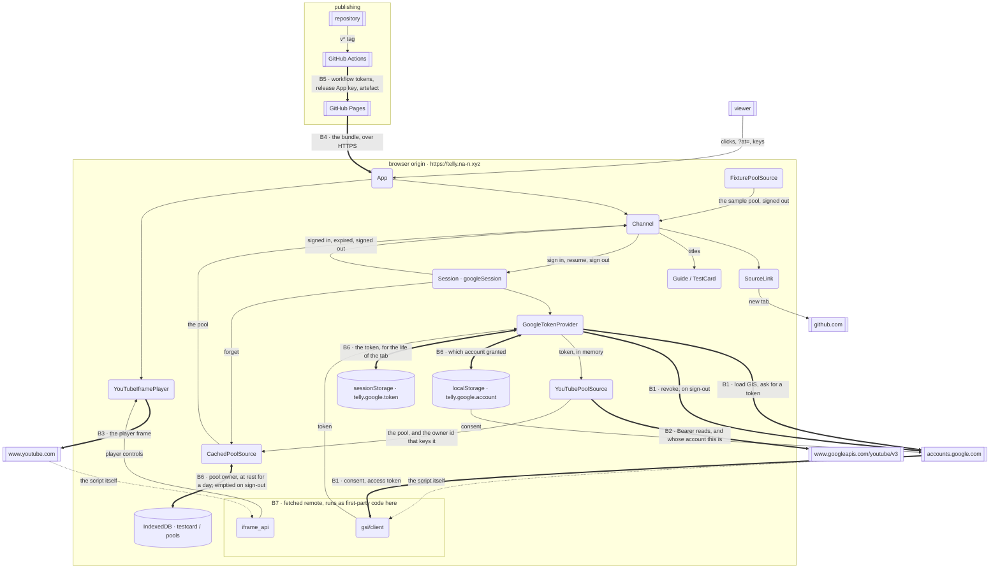

# Threat model

`telly` is a static bundle on GitHub Pages that holds a Google access token in
memory and reads one person's YouTube subscriptions with it. There is no server
of ours: every boundary it has is a line between a browser tab and somebody
else's infrastructure, or between this repository and the machine that publishes
it.

This document models those lines and the threats that live on them. Elements
that sit entirely inside one trust boundary, `domain/`, `schedule/`,
`programming/`, `broadcast/`, which touch no browser API at all
([README.md](README.md)), carry no rows.

## The system, as data flows

Boxes with doubled sides are external entities, rounded boxes are processes, the
cylinder is a data store, and a boxed region is a trust boundary. A bold flow
crosses a boundary; a dotted flow is remote code arriving to run inside the
boundary it lands in.

- **External entities**: the viewer; the Google account and its consent; the
  YouTube Data API; the owners of the channels the viewer subscribes to; GitHub
  as host and as CI.
- **Processes**: `GoogleTokenProvider`
  ([src/library/googleTokenProvider.ts](../../src/library/googleTokenProvider.ts)),
  the `Session` seam over it
  ([src/library/session.ts](../../src/library/session.ts)),
  `YouTubePoolSource`, `CachedPoolSource`, `YouTubeIframePlayer`, the React tree,
  and **the two remote scripts that execute as first-party code in this origin**.
- **Data stores**: the IndexedDB pool
  ([src/library/indexedDbPoolStore.ts](../../src/library/indexedDbPoolStore.ts)),
  keyed per account; the account identifier in `localStorage`, which names an
  account and is not a credential; the access token in the tab's
  `sessionStorage`, which is one; the published bundle on Pages, the CI
  environments `github-pages` and `commitlint`.
- **Data flows**: consent and token; the revocation that hands the grant back;
  API requests carrying `Authorization: Bearer`; API metadata back; the owner id
  that keys the cache; the cached pool; the bundle; the tag that triggers a
  release.

## The boundaries

| | Line | What crosses it |
|---|---|---|
| **B1** | browser origin ↔ `accounts.google.com` | the GIS script, the consent popup, the access token, and the revocation that hands it back |
| **B2** | browser origin ↔ `www.googleapis.com` | bearer-authenticated reads of subscriptions, channels, playlist items and videos |
| **B3** | browser origin ↔ `www.youtube.com` | the IFrame API script, and the player frame that plays the programme |
| **B4** | browser ↔ GitHub Pages | the bundle itself, over HTTPS, at the one origin the OAuth client authorises |
| **B5** | repository ↔ GitHub Actions | a `v*` tag, workflow tokens, the release App's private key, and the artefact that becomes the site |
| **B6** | page session ↔ browser storage | the subscription pool in IndexedDB, filed under `pool:<owner id>` and at rest on the viewer's machine for a day; the account identifier in `localStorage`; and the access token in this tab's `sessionStorage`, which is what carries a session across a reload |
| **B7** | this code ↔ the two remote scripts | `accounts.google.com/gsi/client` and `www.youtube.com/iframe_api` run **inside** the token-holding origin, unversioned and therefore without an integrity hash ([index.html:5-6](../../index.html)) |

B7 is the sharpest of them, because it is the only boundary the same-origin
policy does not draw for us: everything on the far side of B1–B3 is a separate
origin, and everything on the far side of B7 is this one.

## Threats

### B1: sign-in, and the token

| # | Element · STRIDE | Attacker capability | Impact | CWE | Response | Where it lives |
|---|---|---|---|---|---|---|
| T1 | Viewer identity · **S** | none | The app authenticates nobody. Identity is the Google session in the browser, and authorisation is a consent the viewer grants to a scope. The one identity it does learn is `ownerId()`, the signed-in account's own channel id, which keys the cache and is inside the scope already granted. | CWE-287 | **Transfer**: to Google Identity Services | `GoogleTokenProvider` in [googleTokenProvider.ts](../../src/library/googleTokenProvider.ts), `YouTubePoolSource.ownerId` in [youTubePoolSource.ts](../../src/library/youTubePoolSource.ts) |
| T2 | Consent flow · **S** | Hosts a page that presents the same public client ID | A consent granted on an attacker's page yields a token to that page. The client ID is public by design; the authorised-JavaScript-origins list on the OAuth client is what refuses the request, and it names `https://telly.na-n.xyz` alone. | CWE-346 | **Transfer**: to Google's origin check on the OAuth client | [tokens.md](tokens.md), [README.md:240-242](../../README.md) |
| T3 | GIS script flow · **T** | Sits on the network between the browser and `accounts.google.com` | Arbitrary JavaScript in the origin that holds the token. The script URL is `https://` and fixed, and `script-src` names the host. | CWE-494 | **Mitigate** | `GIS_SCRIPT_URL` in [googleTokenProvider.ts](../../src/library/googleTokenProvider.ts), CSP at [index.html:10](../../index.html) |
| T4 | Token in the page · **I** | Runs any script in this origin | Read of the viewer's subscriptions for the token's remaining hour. The scope is read-only and no refresh token exists. `connect-src` permits only `self`, `googleapis.com` and `accounts.google.com`, which closes fetch, `XMLHttpRequest`, `WebSocket`, `EventSource` and `sendBeacon` to every other host. It does not reach top-level navigation or `window.open`, so a script in this origin carries the token out in a URL, and no directive covers that: `navigate-to` left CSP Level 3 in September 2022 and shipped in no browser. The hour and the read-only scope are what bound this threat; the policy narrows it. An expired token is dropped rather than kept as a fallback, and there is no renewal to attempt: a token comes from a popup, which comes from a click. | CWE-522 | **Mitigate** | `#token`, `EXPIRY_MARGIN_MS`, `GoogleTokenProvider.getAccessToken` and `signOut` in [googleTokenProvider.ts](../../src/library/googleTokenProvider.ts); [index.html:14](../../index.html) |
| T35 | Token at rest · **I** | Has the unlocked machine, or runs code in this origin | The token is written to this tab's `sessionStorage` under `telly.google.token`, with the moment it expires, because nothing else can cross a reload: the only way to obtain one is a popup and a page load has no gesture to open one with. Holding it in memory alone was a decision to sign the viewer out on every refresh. What is exposed is a bearer token for a read-only scope that Google already limits to an hour, readable by anything already running in this origin, which is the same reach it has over the token in the page (T4). The record dies with the tab, a restored token past its hour is dropped rather than adopted, and signing out removes it whatever the revocation answers. | CWE-522 | **Accept**: the reload has to carry something, and the token is the only thing that can; the window is the tab's life or the hour, whichever ends first | `TOKEN_KEY`, `rememberToken`, `storedToken`, `resume` and `#discard` in [googleTokenProvider.ts](../../src/library/googleTokenProvider.ts), [tokens.md](tokens.md) |
| T5 | GIS loader · **D** | Blocks the script: an extension, a firewall, an outage | Sign-in is impossible. The loader rejects instead of hanging, the failure is reported under the cabinet, and a failed `prepare()` does not stop the set coming on: signed out with a service configured, the set runs on the fixture pool and the listings say so. | CWE-703 | **Mitigate** | `loadGoogleIdentityServices` in [googleTokenProvider.ts](../../src/library/googleTokenProvider.ts), `sessionError` and `demoSource` in [Channel.tsx](../../src/ui/Channel.tsx), the `prepare()` effect in [App.tsx](../../src/App.tsx) |

### B2: the YouTube Data API

| # | Element · STRIDE | Attacker capability | Impact | CWE | Response | Where it lives |
|---|---|---|---|---|---|---|
| T6 | Request flow · **I** | Reads URLs: browser history, a referrer, a proxy log | A token in a query string is replayable for an hour. It travels in the `Authorization` header, and the error type is built from status, reason and message with no URL and no headers. | CWE-598 | **Mitigate** | `YouTubePoolSource#get` and `toApiError` in [youTubePoolSource.ts](../../src/library/youTubePoolSource.ts) |
| T7 | Video and channel metadata · **T** | Owns a channel the viewer subscribes to, and therefore its titles and tags | Titles reach the DOM as listing rows and as the caption on the test card. Both are React text children (`{entry.label}` and `{shape.text}`, plus an `aria-label` set as a prop) and `src/` contains no `dangerouslySetInnerHTML` and no `innerHTML` write. | CWE-79 | **Mitigate** | `{entry.label}` in [Guide.tsx](../../src/ui/Guide.tsx), `{shape.text}` in [TestCardSvg.tsx](../../src/testcard/TestCardSvg.tsx), the `label` prop on `Screen` in [Channel.tsx](../../src/ui/Channel.tsx) |
| T8 | Watershed metadata · **T** | Owns a subscribed channel, and declares `madeForKids`; YouTube declares `ytAgeRestricted` | A mis-declared video is scheduled before the watershed. The two flags are recorded as the API reports them and the scheduler acts on them. | CWE-807 | **Accept**: the API's judgement is the only age signal available to a browser client, the viewer chose the subscription, and the watershed is read off the API in both directions ([stations.md](stations.md)) | `ageRestricted` and `madeForKids` in `YouTubePoolSource#describeVideos`, [youTubePoolSource.ts](../../src/library/youTubePoolSource.ts) |
| T9 | Quota · **D** | Holds a large subscription list, or reloads repeatedly | The 10,000-unit daily allowance is spent and no pool loads. IDs are batched 50 to a call, the pool is cached for a broadcast day, and quota reasons are classified as their own error. A full load is about 290 units for 200 subscriptions, of which the owner call is one. | CWE-770 | **Mitigate** | `batchIds`, `QUOTA_REASONS` in [youTubePoolSource.ts](../../src/library/youTubePoolSource.ts), `DEFAULT_POOL_TTL_MS` in [cachedPoolSource.ts](../../src/library/cachedPoolSource.ts) |
| T10 | Load loop · **D** | Deletes or privates one subscribed channel | One 404 playlist ends the whole load. `isFatal` is 401, 403, 429 and every `QuotaExceededError`; anything else costs that channel alone. | CWE-703 | **Mitigate** | `isFatal` and `YouTubePoolSource#listRecentVideoIds` in [youTubePoolSource.ts](../../src/library/youTubePoolSource.ts) |
| T30 | Load loop · **D** | Spends the per-minute rate limit, or the day's quota, part-way through the per-playlist loop | Every remaining playlist fails the same way and the load ends with an empty pool, which the screen reports as an empty subscription list. That was the behaviour until 429 and `QuotaExceededError` joined `isFatal`: the load now abandons on the first of them. A run in which every playlist failed for any reason throws the first error it saw rather than returning nothing. | CWE-754 | **Mitigate** | `isFatal` and the `failures === playlistIds.length` throw in `YouTubePoolSource#listRecentVideoIds`, [youTubePoolSource.ts](../../src/library/youTubePoolSource.ts) |
| T31 | Error text · **I** | Reads the screen, or is shown a screenshot | Google's own message, the endpoint and the status code name internal detail a viewer cannot act on. They stay in the `Error`. `src/ui/faultMessage.ts` holds every sentence a viewer is shown: `faultMessage` for a load that failed, `signInMessage` for a sign-in that produced no token, `signOutMessage` for a sign-out where one half did not happen. Each maps a typed field (`YouTubeApiError.status`, `SignInError.reason`, `SignOutError.revoked` and `.cleared`) to copy, with a test per sentence, and no `error.message` reaches the screen anywhere. Nothing in `src/` calls `console.*`. | CWE-209 | **Mitigate** | [faultMessage.ts](../../src/ui/faultMessage.ts), `poolError` in [Channel.tsx](../../src/ui/Channel.tsx) |

### B3: the player frame

| # | Element · STRIDE | Attacker capability | Impact | CWE | Response | Where it lives |
|---|---|---|---|---|---|---|
| T11 | Player frame · **I** | none (YouTube, by construction) | Watch history and YouTube's own cookies attach to the account inside a frame on `www.youtube.com`, a separate origin that reads neither this DOM nor this token. `frame-src` names the permitted frame origins. | CWE-359 | **Transfer**: to YouTube, disclosed to the viewer | [public/privacy/index.html](../../public/privacy/index.html), [index.html:15](../../index.html) |
| T12 | Player · **D** | Pulls, privates or geoblocks a scheduled video; or blocks the API script | A frame that renders YouTube's own error page fires no `onError`, and the screen stays black. A watchdog reports "no picture" after 8s, the card sits under every programme and is revealed when there is none, and a failed load rebuilds rather than latching. | CWE-390 | **Mitigate** | `DEFAULT_START_TIMEOUT_MS`, `#armWatchdog`, `#onError` and `#teardown` in [youtubePlayer.ts](../../src/player/youtubePlayer.ts), the `hasPicture` gate in [Channel.tsx](../../src/ui/Channel.tsx) |
| T13 | Player frame · **E** | Owns a subscribed channel, and thus what plays | The frame gets no controls, no keyboard, no related videos and no full-screen handover: `controls: 0, disablekb: 1, rel: 0, playsinline: 1`. The viewer is handed a picture and nothing to press. | CWE-1021 | **Mitigate** | `STRICT_TELLY_VARS` in [youtubePlayer.ts](../../src/player/youtubePlayer.ts) |

### B7: the two remote scripts in this origin

| # | Element · STRIDE | Attacker capability | Impact | CWE | Response | Where it lives |
|---|---|---|---|---|---|---|
| T14 | `gsi/client` and `iframe_api` · **T** | Changes what `accounts.google.com` or `www.youtube.com` serves | Either script runs as first-party code beside the in-memory token, with the origin's IndexedDB and DOM. Both are unversioned, so neither carries an SRI hash. CSP is the containment that remains, and it is partial: `default-src 'none'`, `script-src` pinned to `self` and those two hosts, `object-src 'none'`, `base-uri 'self'`, `form-action 'none'`, `connect-src` naming three hosts. It governs what is fetched, framed, submitted and loaded as script. It governs no navigation at all, so script running here reaches any host by navigating to it. The page's own navigations are three anchors to constants: the two legal pages, same-origin, and the source link. The policy ships in the built artefact as well as in source. | CWE-829 | **Accept**: Google already holds the token by virtue of issuing it, and GIS is the only route to one for a browser client with no backend | [index.html:5-19](../../index.html), `dist/index.html` |
| T15 | Response headers · **T** | none | GitHub Pages sets no response headers, and the defaults are the ones sign-in needs: `Cross-Origin-Opener-Policy` defaults to `unsafe-none`, which keeps `window.opener` alive for the consent popup, and cross-origin isolation is absent, which is what lets `gsi/client` load at all. The policy therefore travels in the document. | CWE-693 | **Accept**: the two headers a hardening checklist would add are the two that break this flow silently | [google.md](google.md), *Verification*; [README.md:244-249](../../README.md) |
| T16 | Outbound link · **I** | Controls the linked page | `target="_blank"` hands `window.opener` to the opened page. The link carries `rel="noreferrer noopener"` and its `href` is a constant. | CWE-1022 | **Mitigate** | `SourceLink` in [SourceLink.tsx](../../src/ui/SourceLink.tsx), `SOURCE_URL` in [App.tsx](../../src/App.tsx) |

### B4: the hosted bundle

| # | Element · STRIDE | Attacker capability | Impact | CWE | Response | Where it lives |
|---|---|---|---|---|---|---|
| T17 | Published bundle · **T** | Serves content at `telly.na-n.xyz` | A substituted bundle runs on the one origin the OAuth client authorises, so it obtains tokens for this client ID while the viewer reads the real domain on the consent screen. The site is published only from a tagged release's artefact, and the custom domain is pinned in the repository. | CWE-494 | **Mitigate** | [release.yml:5-7](../../.github/workflows/release.yml), [:88-98](../../.github/workflows/release.yml), [public/CNAME](../../public/CNAME) |
| T18 | Domain · **S** | Claims the `telly` CNAME target, or the registrar account | Identical to T17, and from outside the repository. The DNS record, the Pages custom domain and `public/CNAME` all name the same host, and HTTPS is enforced on it. | CWE-350 | **Transfer**: to the registrar and to GitHub's custom-domain verification | [README.md:232-242](../../README.md) |
| T19 | Host logs · **I** | GitHub | Request IPs and times. The app transmits nothing to this host beyond fetching the bundle: there is no backend, no analytics and no beacon. | CWE-359 | **Accept**: hosting is a static-file fetch and the record is GitHub's, as the privacy policy states | [public/privacy/index.html](../../public/privacy/index.html) |

### B5: repository and CI

| # | Element · STRIDE | Attacker capability | Impact | CWE | Response | Where it lives |
|---|---|---|---|---|---|---|
| T20 | `commits` job · **E** | Opens a pull request, choosing its title | `${{ }}` pasted into a `run:` body is shell source, so a crafted title executes on the runner. The title reaches the shell as the environment variable `TITLE`, which is data. | CWE-94 | **Mitigate** | [analysers.yml:72-75](../../.github/workflows/analysers.yml) |
| T21 | Third-party actions · **T** | Moves a tag on an action's repository | Attacker code in the release runner, where the Pages id-token and the release App's key live. Every third-party `uses:` names a 40-character commit SHA; the only unpinned references are this repository's own reusable workflows. | CWE-829 | **Mitigate** | all of [.github/workflows/](../../.github/workflows/), e.g. [release.yml:35-36](../../.github/workflows/release.yml) |
| T22 | Workflow tokens · **E** | Executes a step, by T20 or T21 | Write access to the repository from a test runner. Each workflow declares `permissions: contents: read` at the top, and write is granted per job: `pages: write` and `id-token: write` on publish, `contents: write` on the release job alone. | CWE-250 | **Mitigate** | [release.yml:9-10](../../.github/workflows/release.yml), [:90-92](../../.github/workflows/release.yml), [:105-106](../../.github/workflows/release.yml), [tests.yml:9-10](../../.github/workflows/tests.yml), [analysers.yml:9-10](../../.github/workflows/analysers.yml), [bumpversion.yml:18-19](../../.github/workflows/bumpversion.yml) |
| T23 | Release provenance · **S** | Pushes a `v*` tag | The live site changes. The release runs the same analysers, tests and CodeQL against the tagged commit before it builds; tags come from `bumpversion.yml` on a push to `main`, authenticated by a short-lived App installation token scoped to this repository; `/src/library/`, `/.github/` and `/SECURITY.md` have a named owner. | CWE-345 | **Mitigate** | [release.yml:15-26](../../.github/workflows/release.yml), [bumpversion.yml:10-12](../../.github/workflows/bumpversion.yml), [:29-38](../../.github/workflows/bumpversion.yml), [CODEOWNERS](../../CODEOWNERS) |
| T24 | Build inputs · **I** | Reads a build log or the artefact | The build reads one value, `vars.VITE_YOUTUBE_CLIENT_ID`, a public identifier held as a variable precisely because marking it secret would only hide it from the log. The App private key is a secret on the `commitlint` environment and is read by no other workflow. Vite inlines only `VITE_`-prefixed variables, and `.env` files are ignored by git apart from the example. | CWE-540 | **Mitigate** | [release.yml:41-43](../../.github/workflows/release.yml), [bumpversion.yml:25-33](../../.github/workflows/bumpversion.yml), the header comment on [createPoolSource.ts](../../src/library/createPoolSource.ts), [.gitignore:18-20](../../.gitignore) |
| T25 | npm dependency tree · **T** | Publishes a version of any package in the tree | Code execution during the build and code in the shipped bundle. Installs are `npm ci` against the committed `package-lock.json` with its integrity hashes, updates arrive weekly and grouped, and CodeQL analyses both `javascript-typescript` and `actions`. | CWE-1357 | **Mitigate** | [tests.yml:22](../../.github/workflows/tests.yml), [release.yml:40](../../.github/workflows/release.yml), [dependabot.yml](../../.github/dependabot.yml), [codeql.yml:28-33](../../.github/workflows/codeql.yml) |

### B6: browser storage, and the viewer's own inputs

| # | Element · STRIDE | Attacker capability | Impact | CWE | Response | Where it lives |
|---|---|---|---|---|---|---|
| T26 | IndexedDB pool · **I** | Has the unlocked machine, or runs code in this origin | A day-old list of subscription titles, channel IDs, video IDs and durations. What is written is the pool and only the pool; no token reaches it, and a browser that offers no store gets television without a cache. Signing out empties the store, so the window is the session rather than the TTL. | CWE-312 | **Accept**: the worst case is that someone reads the subscription list, which [SECURITY.md](../../SECURITY.md) records as the app's worst case | `toStored` in [cachedPoolSource.ts](../../src/library/cachedPoolSource.ts), `IndexedDbPoolStore` and `openPoolStore` in [indexedDbPoolStore.ts](../../src/library/indexedDbPoolStore.ts) |
| T27 | IndexedDB pool · **T** | Writes the origin's `pools` store | A forged schedule: titles and video IDs the viewer never subscribed to, played in the embed for up to a day. The forged fields reach the same escaped text sinks as T7, and a record stamped in the future with a number is distrusted. A record the store cannot read at all is a cache miss rather than a fault. A record that reads back with fields of the wrong type is not checked: absent arrays are defaulted and wrong-typed ones are passed on, so a forged record can make the day unplannable. That now costs one day's listings, not the receiver: `planStations` runs in a render, so the call is wrapped and a throw leaves the set on the air showing the card instead of reaching the root boundary. | CWE-20 | **Accept**: writing this store requires already running in this origin or holding the machine, at which point the pool is the smaller prize | `#isFresh` and `toPool` in [cachedPoolSource.ts](../../src/library/cachedPoolSource.ts), the `listings` memo in [Channel.tsx](../../src/ui/Channel.tsx), [FaultBoundary.tsx](../../src/ui/FaultBoundary.tsx) |
| T29 | The client as a whole · **R** | The account holder | Nothing here records what was read: the app keeps no log and there is no server to keep one. The record of what a token did is Google's own account activity, and consent is revocable from the account, which takes effect immediately. | CWE-778 | **Accept**: a single-viewer television with a read-only scope has no action worth disputing, and the authoritative record sits with the issuer | [public/privacy/index.html](../../public/privacy/index.html) |
| T32 | Account identifier · **I** · **T** | Has the unlocked machine, or runs code in this origin | `localStorage` holds `telly.google.account`, Google's own `sub` for the account that granted, read out of the ID token rather than asked of YouTube. What it discloses is that this Google account has used telly on this device. It is scoped to this client id, so it identifies the account to nobody else; it carries no token, cannot be replayed against Google, and buys no access. Writing it is worth as little: it is the value `login_hint` takes, so signing in again names the account instead of offering a list. Removing it costs one button press. Reads and writes are wrapped, because a browser with site data blocked throws on the property access itself. | CWE-359 | **Accept**: an identifier that grants nothing discloses less than the subscription list sitting beside it, and anyone able to read one can read the other | `ACCOUNT_KEY`, `rememberAccount`, `storedAccount`, `accountFromCredential` and `GoogleTokenProvider.signIn` in [googleTokenProvider.ts](../../src/library/googleTokenProvider.ts) |
| T33 | Two accounts, one browser · **I** | Signs in as a second account on a machine where another has used the set | Reading a cached pool under a shared key would serve the second viewer the first viewer's subscription list. The key now carries whose it is: `CachedPoolSourceOptions.scope` is joined to it and `createPoolSource` passes `() => live.ownerId()`, so the record is `pool:<owner channel id>`. A scope that cannot be established is not a key at all: there is no read and no write, rather than a fall back to the bare `pool`. `YouTubePoolSource.forget()` drops the memoised owner id on sign-out, so the next account is keyed as itself. | CWE-488 | **Mitigate** | `#keyFor` in [cachedPoolSource.ts](../../src/library/cachedPoolSource.ts), `ownerId` and `forget` in [youTubePoolSource.ts](../../src/library/youTubePoolSource.ts), the `scope` option in [createPoolSource.ts](../../src/library/createPoolSource.ts) |
| T34 | Sign-out · **R** | Is offline, or has the GIS script blocked, at the moment the viewer signs out | Half a sign-out. `googleSession.signOut` runs both halves under `Promise.allSettled`, so a revocation that never reaches Google does not stop the store being emptied, and a store that will not empty does not stop the revocation. `GoogleTokenProvider.signOut` drops the local token whatever `revoke` answers, so this page is signed out either way. The residue that remains is a grant still standing on the account, or a record still in the database, and `SignOutError` carries which. The viewer is told which one, because naming the wrong half sends them to fix a thing that is not broken: *Signed out here, and the saved programme list is gone. Your access is still granted at Google: withdraw it in your Google account permissions.* Consent is revocable from the Google account itself at any time. | CWE-613 | **Accept**: the grant is Google's to hold and the account page revokes it; the local residue is disclosed rather than hidden | `signOut` in [googleTokenProvider.ts](../../src/library/googleTokenProvider.ts) and [session.ts](../../src/library/session.ts), `onSignOut` in [Channel.tsx](../../src/ui/Channel.tsx) |

## The accepted risks, collected

Each of these is accepted for a reason that is a property of the design rather
than an omission:

- **T8**: the age and audience flags come from the API because a browser client
  has no other age signal.
- **T14** and **T15**: the two remote scripts execute in this origin without an
  integrity hash, because Google serves them unversioned; CSP is the containment
  that remains, and the response headers a checklist would add break sign-in. The
  policy bounds what is fetched and loaded, not navigation, so script in this
  origin still reaches any host by going there.
- **T19**: the host's request log is GitHub's, and the app sends it nothing but
  a fetch for the bundle.
- **T26**, **T27**: the cached pool is readable and writable by anyone who
  already holds the machine or the origin, and it holds no credential.
- **T29**: there is no log, and the issuer holds the authoritative record.
- **T32**: the account identifier grants nothing and discloses less than the
  pool sitting beside it, to anyone already able to read either.
- **T35**: the token is at rest in the tab's own session storage, because a
  reload has to carry something and nothing else can cross one. It is a bearer
  token for a read-only scope, already limited to an hour, exposed to what is
  already running in this origin.
- **T34**: a sign-out whose revocation fails leaves the grant with Google, who
  can be asked directly to drop it, and the viewer is told what was not cleared.

The scope requested is `youtube.readonly`, so the account is never written to;
the token lasts about an hour; no refresh token and no client secret exist. That
is the ceiling on every one of these.

## When this is re-run

The model is tied to boundaries, not to code. A new external input, a new store,
a new remote script in the origin, a scope beyond `youtube.readonly`, a backend
of ours, or a host that sets response headers each move a line on the diagram
above.
