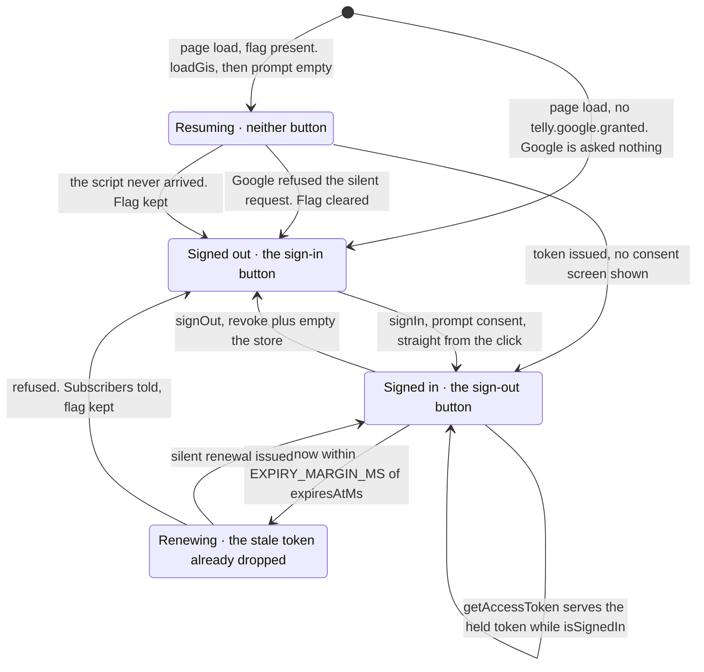
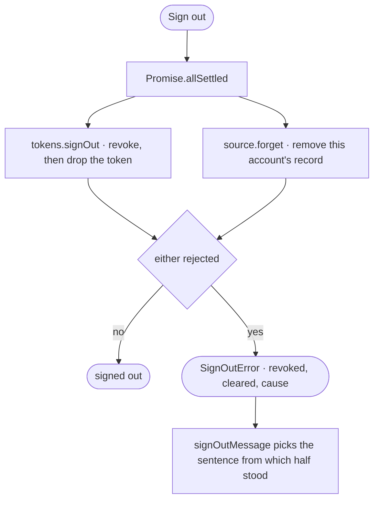

# Token handling

`src/library/googleTokenProvider.ts`, and the seam it is used through,
`src/library/session.ts`.

## The shape, and why it is the right one

Google Identity Services hands a browser a **short-lived access token and no
refresh token**. For a page with no backend that is not a limitation, it is the
correct design: there is no server to keep a refresh token secret from, so there
is no refresh token to leak.

| | |
|---|---|
| Flow | GIS `initTokenClient` — the implicit token flow |
| Scope | `https://www.googleapis.com/auth/youtube.readonly`, and nothing else |
| Lifetime | ~1 hour. Nothing renews it: the next one comes from a click |
| Client secret | none exists |
| Refresh token | none issued |
| Kept in storage | the account identifier, and the token for the life of the tab |

The token **is held in `sessionStorage` for the life of the tab**, and that is
what carries a signed-in session across a reload. It is never logged and never
put in a URL.

It has to be the token that crosses the reload, because nothing else can. The
one way to obtain a token is `requestAccessToken`, which opens a popup window,
and a popup wants a user gesture behind it that a page load does not have. The
silent branch inside GIS is gated on an experiment the shipped script never
turns on, so `prompt: 'none'` falls through to the popup branch like any other
prompt and is refused with `popup_failed_to_open`.

The token is let go one minute early (`EXPIRY_MARGIN_MS`) so a request never
goes out holding a token that dies in flight. At that point the session ends
and the viewer signs in again with one click.

The **client ID is inlined into the bundle**, which is correct and by design:
it is a public identifier. The control that actually matters is the OAuth
client's *authorised JavaScript origins*: that list, not the secrecy of the ID,
is what stops someone else's page using it.

## The gesture rule

This is the whole reason sign-in works, and it is the least obvious thing in the
codebase.

**A popup must be traceable to a user gesture, and that gesture does not survive
a network round-trip.**

Fetch Google's script *inside* the click handler and the browser has already
ended the activating task by the time the popup is asked for. It refuses, and
GIS reports `popup_failed_to_open`. The sign-in button appears to do nothing.

So the provider is split in two:

- **`prepare()`** — called on mount. Fetches the GIS script and builds the token
  client. Idempotent, memoised on `#ready`.
- **`signIn()`** — called *straight from the click*, with no `await` in front of
  it. When the client is already built, `#requestSynchronously` opens the popup
  inside the click's own task, which is the only way a browser will allow it.

The caller must respect the same rule. In `Channel.tsx`:

```tsx
onClick={() => {
  setSessionError(undefined)
  // Straight from the click: an await here would lose the user
  // gesture and the consent popup would be blocked.
  session.signIn().then(
    () => setSignedIn(true),
    // The reason decides the sentence. Google's own wording is for
    // whoever is holding the Error.
    (error: unknown) => setSessionError(signInMessage(error)),
  )
}}
```

Everything `signIn()` rejects with is a `SignInError` carrying Google's
`reason`, including a script that never arrived, which is reported as
`unavailable` because it never reached Google to have a reason of its own.
`signInMessage` turns the reason into the sentence, so a closed window, a
blocked window and a refused scope each ask the viewer for the right thing, and
a reason this app has no sentence for reaches the screen as none of Google's
wording at all.

If the client somehow is not ready, `signIn()` prepares and asks anyway: the
popup may well be blocked, but reporting that beats silently doing nothing.

`getAccessToken()` is the opposite case: a **silent** renewal opens no popup, so
it needs no gesture and is free to `await`. It succeeds while consent stands and
fails (rather than popping up) when it does not.

## The session, from page load to sign-out

Google's token model documents two moments a token is obtained: at page load,
and from a user gesture. `GoogleTokenProvider` has both, and because GIS
refreshes nothing on its own it also has the two moments a token stops being
one.



The two ways out of `resuming` that both land on signed out are not the same
thing, and telling them apart is `resume`'s job: Google refusing is an answer
about the grant, and a script that never arrived is no answer at all.

| Moment | Method | What GIS is asked for | What `subscribe` is told |
|---|---|---|---|
| Page load, this tab held a token | `resume()` | nothing is asked of Google | `true` where the held token has time left, `false` where it does not |
| The button | `signIn()` | `requestAccessToken({ prompt: 'consent' })`, popup | `true` on a token. A refusal says nothing, and the click's own rejected promise carries it |
| The hour runs out | `getAccessToken()` | nothing is asked of Google | `false`: the token goes and the sign-in button comes back |
| The way out | `signOut()` | `oauth2.revoke(token, done)` | `false`, from `#discard` dropping the token |

### The grant flag

`localStorage`, key `GRANT_KEY` (`telly.google.granted`), value `"1"`.

It records that a consent screen was completed in this browser, and that is all
it records. It is not a credential and it is not a token: it cannot be replayed
against Google and it names no account. What it buys is one decision, whether a
silent page-load request is worth sending, which is why a first-time visitor
sends none at all.

- Written in `#onResponse`, at the moment a token is issued.
- Removed when `resume()`'s silent request is refused, and when `signOut()`
  runs. A renewal refused inside `getAccessToken()` leaves it standing: from in
  there a refusal and a blocked script are the same event, and `resume` is where
  a refusal is the answer to the question the flag asks.
- Every read and write goes through `hasGrant` / `rememberGrant`, which swallow
  the throw. A browser with site data blocked throws on the `localStorage`
  property access itself, before any key is named: a private window in Safari
  and Firefox's strict mode both do it. Without the flag the set still works;
  the viewer presses the button instead.

### Resuming

`resume()` returns true when a token is already in hand, and the flag is the
gate on everything else, so a browser that has never granted anything sends no
request.

`Channel` shows neither button while that request is in flight (`resuming`
state). A button saying Sign in, replaced half a second later by one saying Sign
out, is the set telling the viewer two different things.

### Expiry

`isSignedIn` is false once `now()` is inside `EXPIRY_MARGIN_MS` of the expiry,
so the last minute of a token counts as expired.

`getAccessToken()` drops the held token *before* it asks for a new one, rather
than keeping it as a fallback. A renewal that Google refuses announces
signed-out to every subscriber and rethrows: the corner goes back to a sign-in
button instead of offering a way out of a session that has already ended.

A response that says nothing about its own life is treated as the hour GIS
issues. A response whose `expires_in` does not parse as a finite number is
treated as already over, so `isSignedIn` stays false and the next call renews.

### Signing out is two operations

`GoogleTokenProvider.signOut()` calls `google.accounts.oauth2.revoke(token,
done)`, which hands back **every scope granted to this app**, and then drops the
in-memory token. `revoke` needs a live token, so it goes first; the local state
is cleared whatever it answers, because a viewer who asked to be signed out is
signed out of this page either way.

That is only the Google half. `googleSession(tokens, source)` in
`src/library/session.ts` ties it to the other one, and attempts both whatever
either answers:



Revoking alone leaves a day-old copy of the subscriptions in this browser's
database. Clearing alone leaves the grant standing at Google. See
[components.md](components.md) for `forget` and `clear`, and
[google.md](google.md) for what the cache holds.

### Watching, rather than remembering the last click

`subscribe(listener)` reports sign-in, expiry and sign-out. The UI subscribes
once and follows the session, because a token's hour runs out whether or not
anyone touched the set, and a corner that showed the outcome of the last click
would be wrong for as long as the page stayed open.

## The settle bug worth remembering

The token client is built **once**, but every sign-in attempt has its own
resolve/reject pair. The GIS callback is registered at construction, so if it
closes over the *first* attempt's settlers, a second sign-in never settles at
all: the popup completes, the token arrives, and the promise hangs for ever.

The fix is a `#settle` field that the callback reads at call time:

```ts
#settle: { resolve: (token: string) => void; reject: (error: Error) => void } | undefined
```

`#pending` enforces one flight at a time, so two callers cannot open two popups.

## Failing loudly

`loadGoogleIdentityServices` rejects on `script.onerror` and on a script that
loads but exposes no `oauth2` client. A blocked script that never settles is a
screen that never explains itself — and, because jsdom never fetches an external
resource, that failure mode is completely invisible to the test suite. See
[testing.md](testing.md).

## Consent lapses

While the app is unverified, Google expires consent roughly weekly — so expect
to sign in again about once a week. That is a property of the Testing
publishing status, not a bug. [google.md](google.md) covers what verification
would change.
