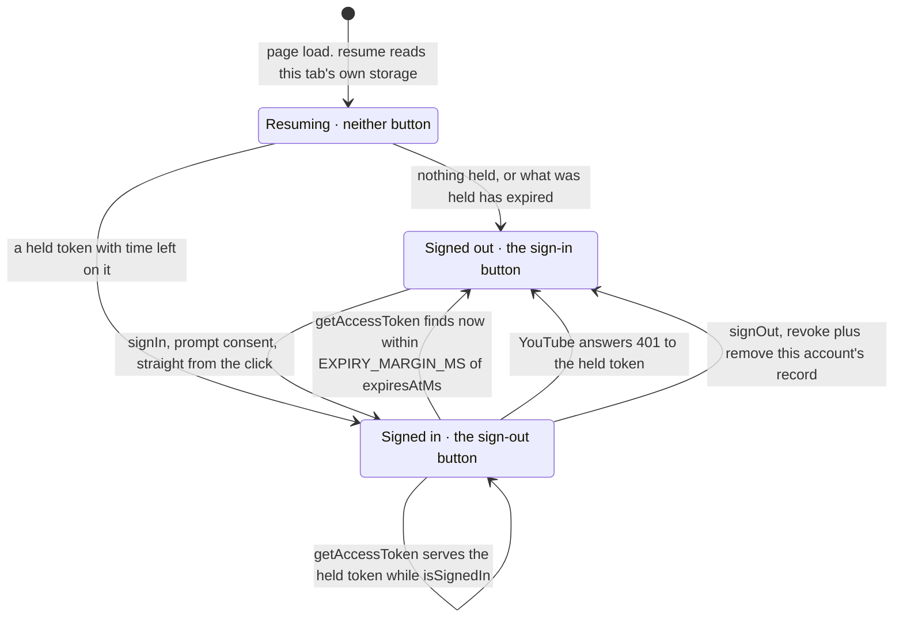

# Token handling

`src/library/googleTokenProvider.ts`, and the seam it is used through,
`src/library/session.ts`.

## The shape, and why it is the right one

Google Identity Services hands a browser a **short-lived access token and no
refresh token**. A page with no backend has no server to keep a refresh token
secret on, and none is issued, so there is none to leak.

| | |
|---|---|
| Flow | GIS `initTokenClient`, which Google bases on the OAuth 2.0 implicit grant flow |
| Scope | `https://www.googleapis.com/auth/youtube.readonly`, and nothing else |
| Lifetime | set by Google and given in `expires_in`; Google describes it as short-lived. Nothing renews it: the next one comes from a click |
| Client secret | none exists |
| Refresh token | none issued |
| Kept in storage | the account identifier, and the token for the life of the tab |

The token **is held in `sessionStorage` for the life of the tab**, and that is
what carries a signed-in session across a reload. It is never logged and never
put in a URL.

The token is what crosses the reload because the app obtains a token one way:
`requestAccessToken`, called from a click on the sign-in button, which opens
Google's popup window. A page load has no click behind it.

The token is let go one minute early (`EXPIRY_MARGIN_MS`) so a request never
goes out holding a token that dies in flight. From then on the app does not use
it. The session ends when the app next needs the token, or on a reload, and the
viewer signs in again with one click.

The **client ID is inlined into the bundle**, which is correct and by design:
it is a public identifier. The control that actually matters is the OAuth
client's *authorised JavaScript origins*: that list, not the secrecy of the ID,
is what stops someone else's page using it. Sign-in runs from
`https://telly.na-n.xyz` and from the development server at
`http://localhost:5173`, which the README's setup adds to the list.

## The gesture rule

This is the whole reason sign-in works, and it is the least obvious thing in the
codebase.

**A popup needs the transient activation a user gesture gives, and that
activation does not last.** MDN: `Window.open()` is one of the APIs that
require transient activation, and transient activation "expires after a timeout
(if not renewed by further interaction)".

Fetch Google's script *inside* the click handler and the activation can run out
before the popup is asked for. The browser then refuses it, GIS reports
`popup_failed_to_open`, and the sign-in button appears to do nothing.

So the provider is split in two:

- **`prepare()`**: called on mount. Fetches the GIS script and builds the token
  client. Idempotent, memoised on `#ready`.
- **`signIn()`**: called *straight from the click*, with no `await` in front of
  it. When the client is already built, `#requestSynchronously` opens the popup
  inside the click's own task, while the activation is still there.

The caller must respect the same rule. In `Channel.tsx`:

```tsx
onClick={() => {
  setSessionError(undefined)
  // Straight from the click: an await here would lose the user
  // gesture and the consent popup would be blocked.
  session.signIn().then(
    () => setSignedIn(true),
    // The reason decides the sentence. Google's own wording is for
    // whoever is holding the Error.
    (error: unknown) => setSessionError(signInMessage(error)),
  )
}}
```

Everything `signIn()` rejects with is a `SignInError` carrying Google's
`reason`, including a script that never arrived, which is reported as
`unavailable` because it never reached Google to have a reason of its own.
`signInMessage` turns the reason into the sentence, so a closed window, a
blocked window and a refused scope each ask the viewer for the right thing, and
a reason this app has no sentence for reaches the screen as none of Google's
wording at all.

If the client somehow is not ready, `signIn()` prepares and asks anyway: the
popup may well be blocked, but reporting that beats silently doing nothing.

`getAccessToken()` never asks for a popup, so it needs no gesture: it hands back
the token already in hand, and once that has expired it drops it and rejects.
Google's token-model guide says an expired token is replaced by calling
`requestAccessToken()` "from a user-driven event such as a button press", and a
request for programmes has no such event behind it.

## The session, from page load to sign-out

A token is obtained one way, from a click, and nothing renews it on its own, so
the token running out is the end of the session rather than the start of a
renewal.



No token is asked for on a page load. The state is read back out of the tab,
so the only question `resume` has to answer is whether what it found is still
good.

| Moment | Method | What GIS is asked for | What `subscribe` is told |
|---|---|---|---|
| Page load, this tab held a token | `resume()` | nothing is asked of Google | `true` where the held token has time left, `false` where it does not |
| The button | `signIn()` | `requestAccessToken({ prompt: 'consent', login_hint })`, popup | `true` on a token. A refusal says nothing, and the click's own rejected promise carries it |
| The token runs out, noticed when it is next asked for | `getAccessToken()` | nothing is asked of Google | `false`: the token goes and the sign-in button comes back |
| YouTube answers 401 | `reject(token)` | nothing is asked of Google | `false`, if the refused token is the one held |
| The way out | `signOut()` | `oauth2.revoke(token, done)` | `false`, from `#discard` dropping the token |

### The held token

`sessionStorage`, key `TOKEN_KEY` (`telly.google.token`), holding the token and
the moment it expires.

Session storage rather than local: it survives the reload it exists for, and
closing the tab clears it. MDN notes that a page session "survives over page
reloads and restores", so a browser that restores a closed tab restores the
record with it. What it holds lasts only as long as the `expires_in` Google
gave it.

- Written in `#onResponse`, at the moment a token is issued, so what the tab
  holds is always a token the app is actually using.
- Removed by `#discard`, which runs on expiry, on a 401 and on sign-out, and
  by `resume()` when the record it finds has expired.
- Read back by `resume()`. Anything that is not the pair this app wrote is
  treated as nothing: a half-written record, another version's shape, or a
  value some other script put under the key. The cost of refusing one is a
  sign-in button.
- Every read and write is wrapped in `try`/`catch`, so a storage access that
  throws costs only the resume. Without the store the set still works, and the
  viewer presses the button after each reload.

### The account identifier

`localStorage`, key `ACCOUNT_KEY` (`telly.google.account`), holding the `sub`
from the ID token Sign In With Google returns.

Google describes `sub` as "The unique ID of the user's Google Account" and as
"unique among all Google Accounts and never reused". Its documentation does not
say whether other client IDs receive the same value. What the app uses it for
is `login_hint` on the next sign-in, which Google documents as skipping account
selection when successful, so a returning viewer is not asked to pick their
account out of a list.

It comes from Sign In With Google rather than from YouTube. The token client
returns an access token and says nothing about whose it is, so `#identify` asks
the identity half after a sign-in, once the viewer already has their
television, unless an identifier is already stored. It keeps the `sub` out of
the ID token and nothing else. If nothing comes back within five seconds
(`IDENTIFY_TIMEOUT_MS`), or what comes back carries no `sub`, nothing is stored,
and the next sign-in goes without a `login_hint`, so Google may ask the viewer
to pick from a list.

### Resuming

`resume()` returns true when a token is already in hand, and otherwise reads the
one this tab stored. A record that has expired is dropped rather than adopted,
so the screen shows the sign-in button and the next token comes from a click.

`Channel` shows neither button while that is being worked out (`resuming`
state). A button saying Sign in, replaced half a second later by one saying Sign
out, is the set telling the viewer two different things.

### Expiry

`isSignedIn` is false once `now()` is inside `EXPIRY_MARGIN_MS` of the expiry,
so the last minute of a token counts as expired.

`getAccessToken()` serves the held token while it is good, and once it is not,
drops it, tells every subscriber, and rejects. It asks Google for nothing:
a new token needs `requestAccessToken()` from a user-driven event, and there is
none behind a request for programmes. So the corner goes back to a sign-in
button. Nothing watches the clock between requests, so until the token is next
asked for, or the page is reloaded, the corner can still offer a way out of a
session that has already ended.

A response without `expires_in` is given 3600 seconds, a value this app chose;
Google's reference lists `expires_in` among TokenResponse's properties. A
response whose `expires_in` does not parse as a finite number is treated as
already over, so `isSignedIn` stays false and the next request for programmes
ends the session.

### Signing out is two operations

`GoogleTokenProvider.signOut()` first forgets the account identifier and asks
GIS to `disableAutoSelect()`, which Google's reference says records the status
in cookies (the `g_state` cookie, [threat-model.md](threat-model.md) T38). Then
it calls `google.accounts.oauth2.revoke(token, done)`, which Google's reference
says "revokes all of the scopes that the user granted to the app", and drops the
token from memory and from the tab's storage. `revoke` needs a valid token, so
it goes before the token is dropped; the local state is cleared whatever it
answers, because a viewer who asked to be signed out is signed out of this page
either way.

Google answers through `done`. `#revoke` resolves only on `successful: true` and
rejects on anything else, which makes `signOut` reject and the screen say Google
did not confirm the revocation. That includes `invalid_token`, which Google's
reference describes as "Token is already expired or revoked before revoke method
is called. In most cases, you can regard the grant associated with the
accessToken is revoked."

That is only the Google half. `googleSession(tokens, source)` in
`src/library/session.ts` ties it to the other one, and attempts both whatever
either answers:


Revoking alone leaves the saved copy of the subscriptions in this browser's
database. Clearing alone leaves the grant standing at Google. See
[components.md](components.md) for `forget` and `clear`, and
[google.md](google.md) for what the cache holds.

### Watching, rather than remembering the last click

`subscribe(listener)` reports sign-in, expiry and sign-out. The UI subscribes
once and follows the session, because a token runs out whether or not anyone
touched the set, and a corner that showed the outcome of the last click would be
wrong for as long as the page stayed open. Expiry is reported when it is
noticed, which is when the token is next asked for.

## The settle bug worth remembering

The token client is built **once**, but every sign-in attempt has its own
resolve/reject pair. The GIS callback is registered at construction, so if it
closes over the *first* attempt's settlers, a second sign-in never settles at
all: the popup completes, the token arrives, and the promise hangs for ever.

The fix is a `#settle` field that the callback reads at call time:

```ts
#settle: { resolve: (token: string) => void; reject: (error: Error) => void } | undefined
```

`#pending` enforces one flight at a time, so two callers cannot open two popups.

## Failing loudly

`loadGoogleIdentityServices` rejects on `script.onerror` and on a script that
loads but exposes no `oauth2` client. A blocked script that never settles is a
screen that never explains itself. The test suite never loads the real script:
the provider takes its loader as an option (`loadGis`), and tests hand it a
fake. See [testing.md](testing.md).

## The Testing publishing status

Google documents that a project in "Testing" "is issued a refresh token
expiring in 7 days". This app receives no refresh token, so that expiry does
not apply to it. [google.md](google.md) covers what verification would change.
